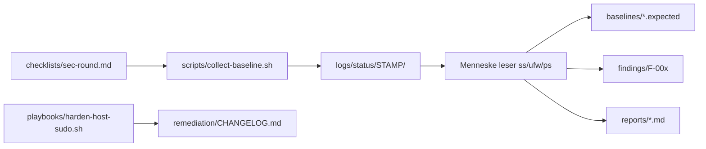
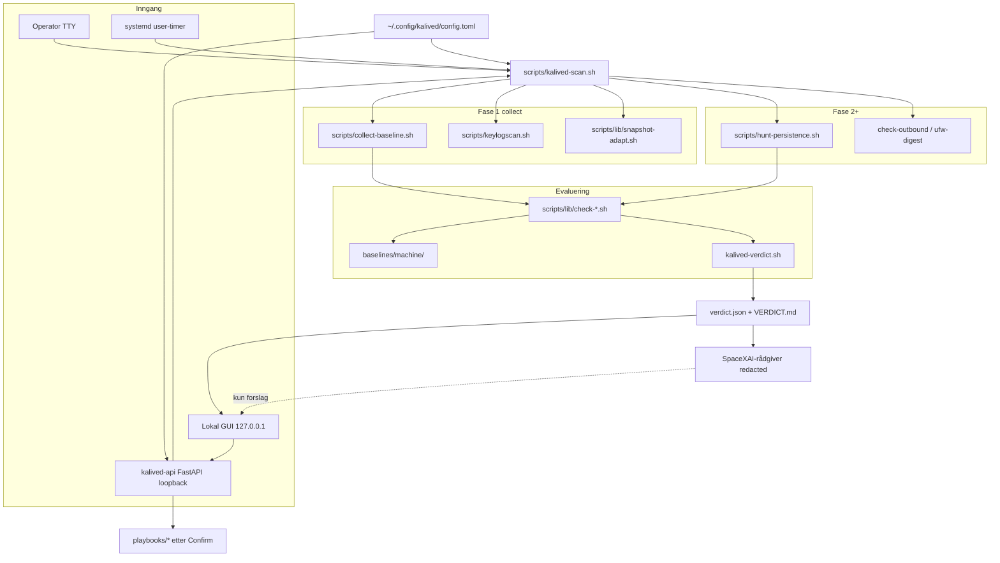
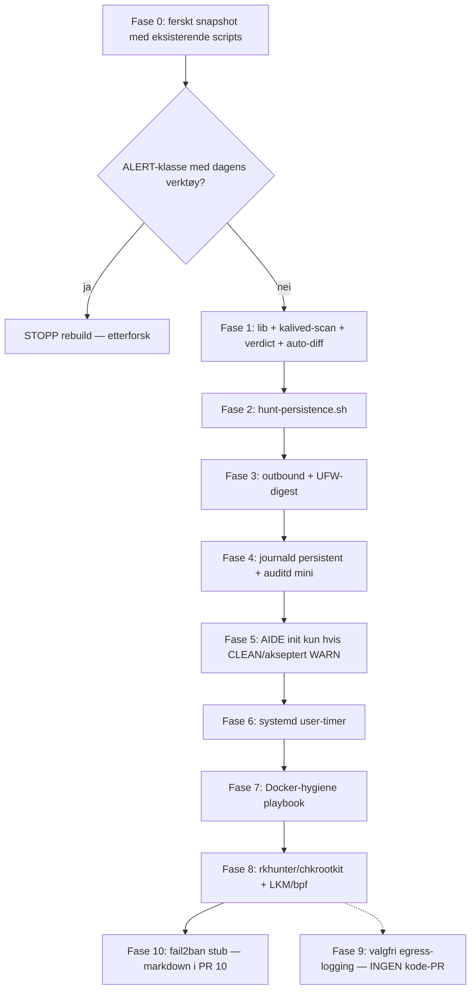

# kalived — kompromissjekk-pipeline + lokal plattform (design + implementasjonsplan)

| Felt | Verdi |
|------|--------|
| Tittel | Gjenoppbygging av kalived: scan-pipeline, lokal GUI/OpenAPI og sandkasse-AI |
| Status | **Draft (rev 4)** — plan først, ingen implementasjon før operator sier start |
| Dato | 2026-09-17 |
| Revisjon | 4 — operatoravgjørelser låst; GUI + OpenAPI + SpaceXAI-rådgiver som PR 11–14 |
| Forfatter | (agent) for operator `void` @ host `kali` |
| Scope | Lokal host-SOC for Kali GNU/Linux Rolling, Lenovo ThinkPad 21MC0059MX, bare metal |
| Arbeidsmappe | `/home/void/kalived` |
| Språk | Bokmål i brukertekst; stier, kommandoer, F-ID-er og kodeidentifikatorer på engelsk som i repoet |

Dette dokumentet er leveransen som skal godkjennes **før** kodeendringer. Ingen produksjonsscripts er endret som del av denne runden. Operatorbeslutninger datert **2026-09-17** er endelige.

---

## Overview

kalived er i dag en **manuell** host-SOC: `scripts/collect-baseline.sh` dumper tilstand til `logs/status/YYYY-MM-DD_HHMM/`, operatoren sammenligner mot `baselines/` og skriver `findings/` + `reports/`. Det fungerte 2026-08-10–13, men siste fulle runde er **~5 uker gammel** (2026-08-13 → 2026-09-17). Collect dumper uten auto-diff, persistensjakt var én one-shot i hermetisk rapport, og `keylogscan.sh` greper prosessnavn med regex `keylog|logkeys|pynput|pyxhook|evtest|logkey` — en bakdør kalt `systemd-helper` er usynlig. (ngrok/anydesk/meterpreter ligger i hermetisk/full-root-rapporter og i `adb-phone-scan.sh`, ikke i keylogscan.) Målet er **ikke** å kaste strukturen, men å gjøre den til en **repetérbar kompromissjekk** med ett brukerrettet inngangspunkt.

Foreslått inngang for *deteksjon*: `scripts/kalived-scan.sh`. Den samler et ferskt snapshot (gjenbruk/utvid `collect-baseline.sh`), kjører ny persistensjakt, differ mot `baselines/` og forrige `logs/status/`, og skriver et **verdict-banner** til terminalen pluss `logs/status/$STAMP/VERDICT.md`, `verdict.json` og en kort `reports/`-fil. Alvorlighetsmodellen er `CLEAN` / `WARN` / `ALERT` / `ERROR`. Brukeren skal aldri måtte tolke rå `ss`/`ps` for å skjønne om døren er åpen. Senere faser legger på auditd, AIDE og rkhunter — men **første fungerende produkt** (fase 1 / PR 2–3) skal allerede varsle tydelig. Fase 0 er en operator-kjøring med **eksisterende** verktøy; hvis den selv finner ALERT-klasse, **stoppes rebuild** og det etterforskes. AIDE initialiseres aldri på en mulig skitten boks.

**Plattform (operator 2026-09-17, høyeste ambisjon):** etter at scannen finnes, en tynn lokal web-GUI + OpenAPI på **kun 127.0.0.1**, pluss en valgfri **SpaceXAI-rådgiver** som forklarer `verdict.json` og foreslår *eksisterende* playbooks. GUI og AI **konsumerer** scannen; de erstatter den ikke. DAG for kompromissjekk (fase 0 + PR 1–10) **endres ikke**. GUI før detektorer er et tomt skall — det sies eksplisitt. **AI får aldri sudo uten operatorens bekreftelse.**

---

## Background & Motivation

### Hvorfor nå

1. **Stale evidens.** Siste fulle root-audit er `reports/2026-08-13_full-root-pc.md` (`logs/status/2026-08-13_1034_full_root/`). Fem uker uten snapshot er i seg selv et funn: det finnes ingen systemd-timer, og `checklists/sec-round.md` krever manuell disiplin som åpenbart svikter.
2. **Eksplisitte hull** (per kilde, ikke alt fra én §12):
   - ingen malware/rootkit-scan (rkhunter/chkrootkit) — `reports/2026-08-10_baseline-security.md` §12
   - ingen ekstern portscan fra annen host; ingen root/netfilter-bekreftelse i første runde — samme §12
   - ingen AIDE/FIM — ikke i §12; gapet er implisitt i senere «anbefalt senere» (`reports/2026-08-13_full-root-pc.md`) og denne rebuilden
   - ingen auditd; `/var/log/auth.log` finnes ikke (journald only) — `reports/2026-08-11_login-ips.md` «Begrensninger»
   - collect dumper, men **auto-diff'er ikke** mot `baselines/` — `README.md` steg 2 er manuell; `collect-baseline.sh` linje 62–69 skriver bare rå `ALERT_non_localhost_tcp.txt`
   - UFW logging `low`; default **allow outgoing** — `baselines/firewall_ufw_default_deny.expected` og `playbooks/harden-host-sudo.sh` linje 88–90
   - persistensjakt var one-shot, ikke et gjenbrukbart script — `logs/status/2026-08-13_1019_hermetic/persistence.txt` + `reports/2026-08-13_hermetic-kali-and-cep1er.md`; ingen `hunt-persistence.sh` i `scripts/`
   - ingen systemd-timer — 5-ukers gap 2026-08-13 → 2026-09-17 mot `checklists/sec-round.md`
   - keylogscan-navnegrep er svakt: faktisk regex i `scripts/keylogscan.sh` er `keylog|logkeys|pynput|pyxhook|evtest|logkey` (ikke ngrok/anydesk). ngrok/anydesk/meterpreter ble grepet i hermetisk/full-root one-shot. En bakdør kalt `systemd-helper` er usynlig for begge.
   - AppArmor: 117 profiler lastet 2026-08-13, 76 **unconfined**, 23 **complain** — `logs/status/2026-08-13_1034_full_root/aa_status.txt` + `reports/2026-08-13_full-root-pc.md`
3. **Trusselkontekst F-010.** PC har brukt USB-tether (`usb0` → gw 192.168.57.4, cep1er) og telefon-hotspot. Kompromittert gateway kan MITM/DNS-hijack. Designet behandler tether som **uærlig nett**, ikke som bevis på at PC allerede er tatt — men DNS/default-route-drift er relevant.

### Hva som allerede er fikset (ikke gjør om)

| ID | Status | Kort |
|----|--------|------|
| F-001 | fixed 2026-08-10_2321 | UFW active, deny in, tomme user-regler, live INPUT drop |
| F-003 | fixed 2026-08-11 / bekreftet 2026-08-13_1028 | AppArmor enabled, 117 profiler |
| F-004 | fixed 2026-08-13_1028 | `/etc/sysctl.d/99-kalived-hardening.conf` |
| F-006 | fixed 2026-08-13_1028 | guest-utils disabled |
| F-008 | accepted/monitor | browser UDP wildcard |
| F-009 | closed (clean) | keylogscan + deep + sudo lsof kun logind+Xorg+upower |

SSH er **masked**. 0 eksterne TCP-lyttere pr. 2026-08-13. 0 remote logins (`reports/2026-08-11_login-ips.md`). Ingen `ld.so.preload`, ingen `authorized_keys`, ingen deleted execs i den scannen.

### Fortsatt åpent

| ID | Status | Relevans for rebuild |
|----|--------|----------------------|
| F-002 | open, low mens SSH av | **Ikke** IDS-erstatning. Playbook-stub fase 10, implementer kun hvis SSH skrus på |
| F-005 | open → policy låst 2026-09-17 | behold `void` i docker-gruppen; playbook **stop-when-idle**; aldri publish `0.0.0.0`. Fase 7 / PR 9 |
| F-007 | open, hygiene | sjekkliste + WARN hvis siste dpkg > 30 dager. **Ingen** unattended-upgrades på Kali rolling |
| F-010 | open, high (nett-tillit) | uendret ADB-scope; DNS/route-sjekk i fase 1–3 |

### Nåværende flyt (as-is)



Smertepunktet er pilen «Menneske leser ss/ufw/ps». `collect-baseline.sh` linje 62–69 skriver allerede `ALERT_non_localhost_tcp.txt`, men det er en rå `ss -tlnp`-dump uten severity, uten aggregert verdict, uten persistens, og uten exit-kode som timer kan bruke.

### Inventory-stale

`inventory/host.md` sier fortsatt at `open-vm-tools` / `virtualbox-guest-utils` er **enabled**. Det ble fikset 2026-08-13_1028. Fase 0 skal oppdatere inventory som del av «god nok til å gå videre».

---

## Goals & Non-Goals

### Goals

1. Ett **deteksjons**-inngangspunkt: `scripts/kalived-scan.sh` som operator, timer **eller GUI/API** kan kjøre. Alle tre funneler hit.
2. Fersk snapshot + auto-diff mot `baselines/` og forrige `logs/status/`.
3. Persistens-/bakdørjakt som **gjenbrukbart** script, ikke one-shot.
4. **Høyt, entydig** brukerrettet varsel ved mistanke — norsk banner, ikke rå dump. Samme banner i GUI.
5. Maskinlesbar sidecar (`verdict.json`) og ikke-null exit på WARN/ALERT/ERROR — kontrakt for timer, API og AI.
6. Graceful degradation uten sudo: kjør det som går, marker «ikke verifisert uten root», aldri stille hopp over `/dev/input`.
7. Behold og utvid findings/report/changelog-arbeidsflyten. Nye F-ID-er for nye detektorklasser.
8. Fixture-baserte tester slik at detektorer kan verifiseres uten å implantere malware.
9. Inkrementell leveranse: fase 0–10 / **PR 1–10** (scan-DAG, uendret rekkefølge) deretter **PR 11–14** (config, OpenAPI, GUI, AI). Fasenummer ≠ PR-nummer.
10. Én runtime-config (`~/.config/kalived/config.toml`) som CLI, GUI og playbooks leser. Operatorvelg uten rebuild.
11. Tynn lokal web-GUI + OpenAPI **kun på loopback**.
12. Valgfri SpaceXAI-rådgiver: forklarer redigert verdict, foreslår allowlistede playbooks, kjører **aldri** sudo uten Confirm.

### Non-goals

- **Ikke** Suricata, Zeek, ClamAV-som-AV, Wazuh, osquery, enterprise EDR.
- **Ikke** produksjonsserver-hardening (dette er XFCE/LightDM-desktop med Cursor, Firefox, grok, Docker/aegir, svl på `127.0.0.1:7878`).
- **Ikke** full egress deny-by-default (ødelegger desktop; fase 9 er valgfri *logging* og har **ingen kode-PR** med mindre operator åpner den igjen).
- **Ikke** utvide ADB-detektorer i PR 1–10. GUI kan ha en **Devices**-stub som senere kaller eksisterende `scripts/adb-phone-scan.sh`. cep1er/iQOO er trusselkontekst (F-010).
- **Ikke** kaste `findings/`, `reports/`, `playbooks/harden-host-sudo.sh` eller eksisterende snapshot-layout.
- **Ikke** hemmeligheter i `kalived/` (passord, nøkler, PSK, `XAI_API_KEY`) — `.env` gitignores; nøkkel aldri til nettleseren.
- **Ikke** tester som starter reverse shells, åpner 0.0.0.0-lyttere på live host, eller installerer rootkits.
- **Ikke** fail2ban som IDS. F-002 venter på ev. SSH.
- **Ikke** å «trene» AIDE eller nye baseliner på ukjent tilstand. Fase 0 først.
- **Ikke** autonom AI-root: modellen kan ikke sudo, ikke skrive baselines, ikke kjøre vilkårlig shell.
- **Ikke** eksponere GUI/API på LAN / `0.0.0.0` / `::`. Fail closed hvis bind ikke er loopback.
- **Ikke** Suricata/Wazuh (uendret). GUI erstatter ikke TTY-scannen.

---

## Proposed Design

### Målarkitektur



Ingen login-hook (ikke `.profile` / PAM). GUI og API er **PR 12–13**, etter at scannen gir ekte verdict. Bygges GUI før PR 3, er det et tomt skall (ingen funn å vise).

Senere faser (4–8) mater **samme** verdict-lag. De er nye `check-*`-moduler, ikke nye inngangspunkter. API **sheller ut** til scripts; den reimplementerer ikke detektorer.

### Komponentansvar

| Komponent | Ansvar | Eies av fase |
|-----------|--------|----------------|
| `scripts/lib/kalived-common.sh` | `ROOT` = repo-rot **alltid**, `STAMP`, `OUT`, farger, sudo-deteksjon, logging | 1 |
| `scripts/lib/kalived-verdict.sh` | `add_finding`, aggregert verdict, banner, `VERDICT.md` / `verdict.json`, `notify-send` no-op uten DISPLAY | 1 |
| `scripts/lib/snapshot-adapt.sh` | normaliser historiske dump til kanoniske filnavn | 1 / 3 |
| `scripts/kalived-scan.sh` | orkestrator: collect → hunt → evaluate → emit; eier `meta.txt` | 1 |
| `scripts/collect-baseline.sh` | uendret dumps + `KALIVED_STAMP`/`KALIVED_OUT`-override; flere filer over tid | 0 (kjøres) / 1 (override) |
| `scripts/hunt-persistence.sh` | crontab, systemd utenfor /lib, autostart, udev, ld.so.preload, keys, UID 0, SUID-diff, Docker runtime | 2 |
| `scripts/keylogscan.sh` | beholdes som navnegrep-modul (svak); `/dev/input` via sudo lsof | 1 (kalles), 2 (input-holders i hunt) |
| `scripts/lib/check-*.sh` | rene funksjoner: les filer, sammenlign, `add_finding` | 1–3, 8 |
| `scripts/adb-phone-scan.sh` | **uendret**, ikke kalt av `kalived-scan.sh` | — |
| `playbooks/harden-host-sudo.sh` | uendret; nye playbooks ved siden av | 4–10 |
| `baselines/*.expected` | menneskelesbar kontrakt, beholdes | — |
| `baselines/machine/*` | grep-/awk-vennlige regler for detektorer | 1 |
| `scripts/testdata/` | fixture-snapshots (ss, find, passwd, …) | 1 |
| `~/.config/kalived/config.toml` | runtime-knapper (CLI+GUI+playbooks) | **PR 11** |
| `api/openapi.yaml` + `kalived-api` | FastAPI 127.0.0.1; wrapper rundt scan/playbooks | **PR 12** |
| `gui/` | tynn norsk web-UI | **PR 13** |
| `scripts/lib/kalived-ai.sh` / API `/ai/advise` | SpaceXAI-rådgiver, allowlist, Confirm | **PR 14** |
| `/usr/local/lib/kalived/` | valgfri root:root-kopi for `scan_sudo_mode=helper` | PR 11 + install-playbook |

### Plattform: config, OpenAPI, GUI, AI (PR 11–14)

Scan-DAG (PR 1–10) er uendret og **må lande først**. Denne seksjonen er den operatoren ba om 2026-09-17: «full plattform nå: scan + GUI + AI-agent», tegnet inn **før kode**.

#### Config-fil (én sannhet)

**Live fil:** `~/.config/kalived/config.toml` (GUI skriver hit; ikke git-treet).  
**Mal i repo:** `config/kalived.toml.example`.  
**Søkesti (første treff vinner):** `$KALIVED_CONFIG` → `~/.config/kalived/config.toml` → `$ROOT/config/kalived.toml`.

CLI (`kalived-scan.sh`, playbooks) og API leser samme fil. Env-variabler overstyrer for én kjøring (`KALIVED_SUDO=1` slår `scan_sudo_mode` for den prosessen).

```toml
# ~/.config/kalived/config.toml
listen_bind = "127.0.0.1"
listen_port = 8787          # ikke 7878 (svl). Prosessnavn kalived-api
scan_sudo_mode = "prompt"   # prompt | helper | never
aide_init_policy = "allow_known_warn"
# clean_only | allow_known_warn | always_prompt
apparmor_enforce_selected = false
docker_stop_idle = true     # playbook --stop-idle når 0 containere
timer_enabled = false       # opt-in etter første live scan
ai_enabled = false
ai_model = "grok-4.6"       # pin; oppdatér i config, ikke i kode
ai_base_url = "https://api.x.ai/v1"
```

`aide_init_policy` **erstatter** env `KALIVED_AIDE_ALLOW_WARN`:

| Verdi | Playbook-oppførsel |
|-------|-------------------|
| `clean_only` | init kun hvis siste verdict CLEAN |
| `allow_known_warn` | **default (anbefaling).** Init ved CLEAN, eller WARN der alle funn er kjent hygiene: `SUDO-MISS-*` som ble løst i samme sudo-kjøring, docker-socket (F-005), F-010 tether, F-007 dpkg-alder, `INPUT-PARTIAL`. **Aldri** ved ALERT, ny uforklarlig SUID i /usr, eller ny ukjent localhost-lytter |
| `always_prompt` | krev interaktiv ja/nei (TTY eller GUI-modal); aldri still init |

`scan_sudo_mode`:

| Verdi | Oppførsel |
|-------|-----------|
| `prompt` | **default.** `sudo -v` deretter `sudo -n` (eksisterende kontrakt). GUI bruker pkexec/sudo-prompt |
| `helper` | kall root:root-kopi under `/usr/local/lib/kalived/` (install-playbook). **Ingen** NOPASSWD mot `/home/void/kalived` |
| `never` | aldri sudo; SUDO-MISS som i dag |

GUI/API kan endre disse uten rebuild. Muterende playbooks respekterer fortsatt fase 0-gate (G1–G10).

#### Katalog: CLI / env / playbooks GUI og OpenAPI skal eksponere

**I dag (eksisterende scripts):**

| Handling | Kommando | GUI/API |
|----------|----------|---------|
| Collect | `scripts/collect-baseline.sh` ± `KALIVED_SUDO=1` | `POST /scan` med `skip_hunt` tilsvarende; eller behold som intern |
| Keylogscan | `scripts/keylogscan.sh` ± `KALIVED_SUDO=1` | intern i scan; ev. `POST /tools/keylogscan` |
| ADB (stub) | `scripts/adb-phone-scan.sh` | Devices-fane, `POST /devices/adb-scan` — **stub i PR 13**, ingen nye detektorer |
| Harden host | `sudo bash playbooks/harden-host-sudo.sh` | `POST /playbooks/harden-host-sudo` + Confirm-modal |

**Planlagt scan:**

| Handling | Flagg / env |
|----------|-------------|
| Kjør scan | `kalived-scan.sh` |
| Med sudo | `--sudo` / `KALIVED_SUDO=1` (styrt av `scan_sudo_mode`) |
| Historisk dump | `--from-dir DIR` |
| Fixture/test | `--fixture DIR` (`KALIVED_FIXTURE=1`) — **ikke** i GUI |
| Quiet/JSON | `--quiet` (`NO_COLOR=1`) — API bruker dette |
| Uten hunt | `--skip-hunt` |
| Hjelp | `--help` |
| Env | `KALIVED_ROOT` (alltid repo), `KALIVED_OUT`, `KALIVED_STAMP`, `KALIVED_FIXTURE` |
| Verdict | CLEAN/WARN/ALERT/ERROR, exit 0/1/2/3 |

**Playbooks (alle Confirm i GUI; gated der designet krever G1–G10):**

| Playbook | Flagg | Gate |
|----------|-------|------|
| `journald-persistent.sh` | — | fase 0 grønn |
| `auditd-mini.sh` | — | fase 0 grønn |
| `ufw-logging-medium.sh` | — | fase 0 grønn |
| `aide-init.sh` | leser `aide_init_policy` | fase 0 + policy; GUI tilbyr **ikke** AIDE-init hvis G1–G10 feilet |
| `install-user-timer.sh` | enable/disable fra `timer_enabled` | etter første live scan (opt-in) |
| `docker-hygiene.sh` | `--prune`, `--stop-idle` | `--stop-idle` default true per operator; `--prune` Confirm |
| `rkhunter-setup.sh` | — | fase 0 grønn |
| `install-kalived-helper.sh` | kopier til `/usr/local/lib/kalived` | kun hvis `scan_sudo_mode=helper` |

#### Lokal OpenAPI (PR 12)

- Spec: `api/openapi.yaml` (OpenAPI 3).
- Impl: FastAPI (Python 3, allerede krevd for `verdict.json`). Bind **kun** `listen_bind`/`listen_port` fra config. Default `127.0.0.1:8787`.
- Start: `python3 -m kalived_api` eller `scripts/kalived-api.sh`. Hvis socket ikke er loopback (`127.0.0.1` / `::1` / unix socket) ⇒ **fail closed**, ikke lytt.
- **Dogfood:** `kalived-api` på 127.0.0.1 er allowlistet i `baselines/machine/tcp_listen_allow.txt` (`kalived-api` / `uvicorn`). Samme prosess på `0.0.0.0` / LAN ⇒ `NET-LISTEN-EXT` **ALERT**.
- Auth: Bearer-token i `~/.config/kalived/api.token` mode 0600, header `X-Kalived-Token`. Ingen anonym bind. CSRF: same-origin, kun localhost.
- Prosess kjører som `void`. Ingen passord i API. Mutasjon: (1) pkexec/sudo-prompt eller (2) helper hvis `scan_sudo_mode=helper`.
- Shell-out: `subprocess` med argument-liste (aldri `shell=True` på modell-output).

**Endepunkter (minimum):**

| Metode | Sti | Hva |
|--------|-----|-----|
| GET | `/health` | `{ok, bind, version}` uten token-hemmelighet |
| GET | `/config` | gjeldende knapper (ikke API-nøkler) |
| PUT | `/config` | oppdater tillatte nøkler; valider enum |
| GET | `/verdict/latest` | siste `verdict.json` + banner-tekst |
| GET | `/history` | liste `logs/status/*` med `kalived_scan=1` |
| GET | `/history/{stamp}` | `verdict.json` for stamp |
| POST | `/scan` | body `{sudo: bool, skip_hunt: bool}` → kjør `kalived-scan.sh --quiet`; returner verdict. 409 hvis scan allerede kjører |
| POST | `/playbooks/{name}` | body `{confirm: true, args: []}` — `name` ∈ allowlist; `confirm` påkrevd |
| GET | `/playbooks` | allowlist + om G1–G10 blokkerer |
| POST | `/ai/advise` | redacted verdict inn; forslag ut (PR 14; 503 hvis `ai_enabled=false` eller ingen nøkkel) |
| POST | `/devices/adb-scan` | stub 501 inntil senere; kaller kun eksisterende script |

#### Tynn GUI (PR 13)

Samme prosess serverer statisk UI (`gui/`): HTML + fetch eller HTMX. Norsk.

Skjermer:

1. **Hjem:** siste verdict-banner (CLEAN/WARN/ALERT/ERROR, samme mal som TTY), funnliste, «Sudo: ja/nei».
2. **Kjør scan** / **Kjør med sudo** (prompt eller helper).
3. **Historikk:** stamps fra `/history`.
4. **Config-toggles:** `aide_init_policy`, `scan_sudo_mode`, `docker_stop_idle`, `timer_enabled`, `ai_enabled`, `apparmor_enforce_selected` (off default).
5. **Playbooks:** knapper med **Confirm-modal** («Dette kjører X som root. Fortsett?»). AIDE-init skjules/disables hvis G1–G10 ikke er grønn.
6. **AI-panel:** forslag; hver handling har Confirm; utilgjengelig uten nøkkel/nett.
7. **Devices:** stub («ADB-scan kommer; scriptet `adb-phone-scan.sh` er uendret»).

Hvis PR 13 lander før PR 3: GUI viser «ingen scan ennå» — tomt skall, ikke falsk CLEAN.

#### SpaceXAI-rådgiver (PR 14)

- Provider: xAI. `XAI_API_KEY` i gitignored `~/.config/kalived/env` (ikke i nettleser, ikke i `verdict.json`). Base `https://api.x.ai/v1`. Default modell `grok-4.6` (flaggskip pr. docs.x.ai 2026-08; pin i config).
- Rolle: **rådgiver/forklarer**, ikke autonom hardener.
- Inn: redigert JSON: `verdict`, `exit_code`, `sudo`, `counts`, `findings[]` med `id`, `severity`, `title` (bokmål), kort `detail` uten rå `ss`/`ps`. **Ikke** last opp: `ss_tulpn.txt`, full `ps`, auth/audit-logger, ssh-nøkler, packet dumps, `passwd`, docker Env. F-010: tether er uærlig nett — minst mulig sky-data.
- Ut: bokmål forklaring + ordnet liste `{playbook|scan_flag, reason, confirm_required: true}`.
- Kjøring: GUI viser forslag; operator Confirm → API kjører **navngitt** allowlist-verktøy lokalt. Modell-output parses som JSON-schema; kommandoer som ikke er i allowlist **avvises** (prompt injection via prosessnavn `'; ufw disable`).
- Allowlist (lukket): `scan`, `scan_sudo`, `playbook.journald-persistent`, `playbook.auditd-mini`, `playbook.ufw-logging-medium`, `playbook.aide-init`, `playbook.install-user-timer`, `playbook.docker-hygiene`, `playbook.rkhunter-setup`, `playbook.harden-host-sudo`, `config.set` (kun kjente nøkler). Ikke: `bash`, `ufw disable`, baseline-write, vilkårlig `apt`.
- Offline: `ai_enabled=false` eller manglende nøkkel/nett ⇒ GUI virker; AI-panel «utilgjengelig».
- Valgfritt senere: «agent-session» som går G1–G10 med operator. Fortsatt ingen auto-root.

#### API-angrepsflate (førsteklasses risiko)

En lokal web-UI kan misbrukes av en ondsinnet side (DNS rebinding, CSRF, token-tyveri) hvis auth er feil.

Mitigering: kun loopback; token 0600; `Host` må være localhost/127.0.0.1; ingen WAN; fail closed på bind; dogfood NET-LISTEN-EXT; AI uten sudo; Confirm på all mutasjon. Start ikke API som default i PR 1–10.

### Orkestrator-kontrakt (`kalived-scan.sh`)

```bash
# Bruk
./scripts/kalived-scan.sh              # uten sudo; minst WARN (SUDO-MISS-*)
KALIVED_SUDO=1 ./scripts/kalived-scan.sh
./scripts/kalived-scan.sh --sudo       # alias
./scripts/kalived-scan.sh --from-dir logs/status/2026-09-17_141053
./scripts/kalived-scan.sh --fixture scripts/testdata/cases/alert_listen_ncat
./scripts/kalived-scan.sh --help
```

Flagg:

| Flagg / env | Effekt |
|-------------|--------|
| `--help` | skriv brukstekst til stdout, exit 0. Ukjent flagg ⇒ stderr + exit 3 (`ERROR`) |
| `--sudo` / `KALIVED_SUDO=1` | orkestrator kjører `sudo -v` (prompt **én** gang), deretter barn kun `sudo -n`. Hvis `-n` feiler: `SUDO-MISS-*`, ikke heng. **Ignoreres** når `--fixture` er satt |
| `--from-dir DIR` | hopp over live collect/hunt. **DIR er read-only.** Kopiér innhold til fersk `$ROOT/logs/status/$STAMP/` (`OUT`). Kjør adapter som **merge** inn i `OUT` (se under). Ingen live `ss`/`ps`/`lsof`. Skriv aldri `verdict.json` / `meta.txt` / `.adapted/` tilbake i DIR |
| `--fixture DIR` | som `--from-dir` (kopi til fersk `OUT`), **pluss** `KALIVED_FIXTURE=1`. `ROOT` forblir repo-roten. `--sudo` ignoreres. Ingen live `ss`/`ps`/`lsof`/`systemctl`. **`KALIVED_OUT` peker på kopien, aldri på `scripts/testdata/`** |
| `--skip-hunt` | bare collect + eksisterende auto-diff (fase 1 før fase 2 lander) |
| `--quiet` | `NO_COLOR=1`; banner på **stderr**; `verdict.json`-innhold på **stdout**. Uten `--quiet`: banner på stdout, JSON **kun** til fil `$OUT/verdict.json` |
| `--accept-alert-suppress` | tillat at `baselines/machine/suppress.txt` slår av ALERT-ID (ellers kan suppress kun dempe WARN/INFO) |
| `NO_COLOR=1` | respekteres uansett |
| `KALIVED_STAMP` / `KALIVED_OUT` | tving samme mappe på child-scripts |
| `KALIVED_FIXTURE=1` | hard regel: collect/hunt/check **skal ikke** kalle live `ss`/`ps`/`lsof`/`ip`/`systemctl` |

**`ROOT` er alltid repo-roten**, aldri fixture-mappen:

```bash
# I alle scripts under scripts/ (også når --fixture):
ROOT="$(cd "$(dirname "$0")/.." && pwd)"
STAMP="${KALIVED_STAMP:-$(date +%Y-%m-%d_%H%M%S)}"
OUT="${KALIVED_OUT:-$ROOT/logs/status/$STAMP}"
```

**Isolert `OUT` for `--from-dir` / `--fixture` (hard regel — aldri muter evidens):**

```
1. mkdir -p "$OUT"          # fersk logs/status/$STAMP, aldri DIR selv
2. cp -a "$DIR"/. "$OUT"/   # kilde forblir urørt (testdata, 1034_full_root, 2321, …)
3. snapshot-adapt.sh --merge --src "$DIR" --dst "$OUT"
     # overlay kun manglende kanoniske filer; behold søsken som allerede
     # finnes i kopien (ip_route.txt, nm_active.txt, ss_established.txt, …)
4. Skriv meta.txt / findings.jsonl / VERDICT.md / verdict.json / scan.log
     KUN i $OUT
5. --from-dir på 2026-08-dump setter kalived_scan=1 kun i kopien, ikke i kilden
     (så neste «forrige snapshot» ikke peker på et tilskrevet august-tre)
```

`scripts/tests/run.sh` leser `$OUT/verdict.json` etter `--fixture`; `scripts/testdata/` skal ha uendret `git status` / mtime. Adapter skriver **ikke** `$DIR/.adapted/`.

Standalone `collect-baseline.sh` / `keylogscan.sh` **uten** env beholder dagens `YYYY-MM-DD_HHMM`. Orkestratoren setter alltid `KALIVED_STAMP` med `%S`.

`keylogscan.sh` og `collect-baseline.sh` skriver **ikke** over orkestratorens `meta.txt` når `KALIVED_OUT` er satt (se Snapshot-layout). På live scan er `OUT` den nye stamp-mappen collect skrev til. På `--from-dir`/`--fixture` er `OUT` kopien over.

### Snapshot-layout (bakoverkompatibel)

Behold flat collect-layout som i `logs/status/2026-08-10_2321/` (`ss_tulpn.txt`, `sec_units.txt`, …). Nye filer **legges til**, ingenting flyttes.

**Kanoniske filnavn** `check-*` leser (etter ev. adapter). Live collect fra PR 2+ skriver disse direkte:

| Kanonisk fil | Produsent | Første PR |
|--------------|-----------|-----------|
| `meta.txt` | **orkestrator** (append-only nøkler). Collect/keylogscan skriver *ikke* `meta.txt` når `KALIVED_OUT` er satt | 2 |
| `ss_tulpn.txt` | collect (`ss -tulpn`, native format) | eksisterende |
| `ss_established.txt` | collect (`ss -tpn state established`, native format — **ikke** normaliser til tulpn-kolonner) | eksisterende |
| `sec_units.txt` | collect | eksisterende (mangler i `2026-08-10_2305/`, der heter det `sec_units_active.txt` / `sec_units_enabled.txt`) |
| `passwd.txt` | collect | eksisterende |
| `suid.txt` | collect | eksisterende |
| `ufw_conf.txt`, `ufw_default.txt`, `ufw_service.txt` | collect uten sudo | eksisterende |
| `ufw_status.txt` | collect med sudo (`ufw status verbose`) | eksisterende når `KALIVED_SUDO=1` |
| `nft_ruleset.txt` | collect med sudo | eksisterende når `KALIVED_SUDO=1` |
| `ALERT_non_localhost_tcp.txt` | collect rådump, beholdes | eksisterende |
| `listen_cmdlines.txt` | collect: `pid cmdline` for TCP LISTEN-PIDer (for PENTEST java/python-match). Ved `--from-dir`/`--fixture`: bare hvis filen fantes i kilden; **ikke** live `/proc` | **PR 3** |
| `resolv.txt` | collect: `cp /etc/resolv.conf` | **PR 5** |
| `ip_link_detail.txt` | collect: `ip -d link` | **PR 5** |
| `ufw_journal.txt` | collect med sudo: `journalctl -k -S -24h --grep='UFW BLOCK'` (fil, ikke live i check) | **PR 5** |
| `keylog_summary.txt` | keylogscan når `KALIVED_OUT` satt (standalone: `summary.txt` i egen mappe) | 2 |
| `keylog_lsof_event0.txt` | keylogscan sudo; hunt overtar primær input i PR 4 som `hunt_input.txt` | 2 |
| `hunt_*.txt` | kun `hunt-persistence.sh` | 4 |
| `findings.jsonl`, `VERDICT.md`, `verdict.json` | verdict-lag | 2 |

```
logs/status/$STAMP/
  meta.txt
  ss_tulpn.txt
  ss_established.txt
  ...
  hunt_cron.txt
  hunt_input.txt
  findings.jsonl
  VERDICT.md
  verdict.json
```

`reports/YYYY-MM-DD_HHMMSS_scan.md` er det korte menneskelige sammendraget (sekund i navnet unngår kollisjon ved to scan samme kalenderdag).

#### `meta.txt` — orkestratoren eier filen

Orkestrator oppretter/append’er **etter** collect, aldri ved å la child overwrite. Nøkler (`key=value`, én per linje):

```
stamp=2026-09-17_141053
date=2026-09-17T14:10:53+02:00
host=kali
user=void
boot_id=...                 # kopieres fra collect hvis collect skrev en temp-meta
virt=none
kalived_scan=1
sudo=0
scan_version=1              # økes når nye kanoniske filer innføres (PR 3=1, PR 4=2, PR 5=3)
fixture=0
adapted=0                   # 1 hvis snapshot-adapt.sh kjørte
```

Collect når `KALIVED_OUT` er satt: skriv collect-felt til `$OUT/collect_meta.txt` (ikke `meta.txt`). Keylogscan når `KALIVED_OUT` er satt: **ingen** `meta.txt`; kun `keylog_summary.txt` / `keylog_lsof_event0.txt`. Standalone keylogscan (ingen `KALIVED_OUT`) beholder dagens `$OUT/meta.txt` i `${STAMP}_keylogscan/`.

#### Snapshot-adapter (historiske dump er *ikke* collect-layout)

`logs/status/2026-08-13_1034_full_root/` er en **tilpasset concatenert dump**, ikke `collect-baseline.sh`-output. Faktiske filer: `aa_status.txt`, `extra_and_phone_gw.txt`, `meta.txt`, `nft.txt`, `nft_full.txt`, `nft_summary.txt`, `ports_ssh_input_sysctl.txt`, `services_auth_keys.txt`, `ufw.txt`. **Ingen** `ss_tulpn.txt`, `ss_established.txt`, `sec_units.txt`, `passwd.txt`, `ufw_status.txt`, `nft_ruleset.txt`, `suid.txt`, `hunt_input.txt`.

Nærmeste collect-formede sudo-snapshot: `logs/status/2026-08-10_2321/` (`ss_tulpn.txt`, `sec_units.txt`, …) men UFW live ligger i `logs/ufw/2026-08-10_2321_status.txt` og nft er `nft_summary.md` / `scans/firewall/`, ikke `ufw_status.txt` / `nft_ruleset.txt`. `2026-08-10_2305/` har `sec_units_active.txt` / `sec_units_enabled.txt`, ikke `sec_units.txt`.

`scripts/lib/snapshot-adapt.sh --merge --src DIR --dst OUT` kjører når **minst én** mappet kanonisk fil mangler i `OUT` **og** en kjent kilde finnes — **ikke** bare når `ss_tulpn.txt` mangler. 2321 har allerede `ss_tulpn.txt` men mangler `ufw_status.txt`; uten denne triggeren blir sibling-mappingen død og NET-UFW blir SNAP-MISS i stedet for å bruke `logs/ufw/2026-08-10_2321_status.txt`.

Adapteren er en **merge**, ikke et erstatnings-subtre: eksisterende filer i `OUT` (kopiert fra DIR) beholdes; kun manglende kanoniske navn fylles inn. Skriv **kun** til `OUT`, aldri til `DIR` eller `DIR/.adapted/`.

**Stamp-parsing for søsken utenfor DIR:**

- Basename av `logs/status/YYYY-MM-DD_HHMM` eller `YYYY-MM-DD_HHMMSS` → stamp.
- Suffiks `_full_root`, `_hermetic`, `_harden` strippes **ikke** for ufw-søk hvis hele basenamet er `2026-08-13_1034_full_root` (ingen matching ufw-fil forventes). For collect-mapper uten suffiks: `logs/status/2026-08-10_2321` → `logs/ufw/2026-08-10_2321_status.txt` og `scans/firewall/2026-08-10_2321_nft.txt` hvis de finnes.
- Regex: stamp = første `YYYY-MM-DD_HHMM` (valgfritt `SS`) i basename.

| Kilde (i DIR, eller søsken under `$ROOT`) | Kanonisk output i **OUT** (kun hvis den filen mangler der) |
|------------------------------------------|--------------------------------------------------------------|
| `ports_ssh_input_sysctl.txt` seksjon `=== LISTEN ALL ===` | `ss_tulpn.txt` |
| `ports_ssh_input_sysctl.txt` seksjon `=== LSOF … ===` | `hunt_input.txt` |
| `ufw.txt` (strip `=== UFW ===`) | `ufw_status.txt` |
| `nft_full.txt` eller `nft.txt` | `nft_ruleset.txt` |
| `nft_summary.md` / `scans/firewall/${stamp}_nft.txt` | `nft_ruleset.txt` (hvis full nft ikke finnes; summary alene er bedre enn ingenting, merk `adapted_nft=summary`) |
| `services_auth_keys.txt` `=== USERS` / passwd-linjer | `passwd.txt` |
| `ss.txt` (hermetisk) | `ss_tulpn.txt` |
| `ss_est.txt` / hermetisk wrapped `=== ESTABLISHED` | `ss_established.txt` (behold native kolonner; strip `===` headers) |
| `sec_units_active.txt` + `sec_units_enabled.txt` | `sec_units.txt` (konkatener med overskrifter) |
| `$ROOT/logs/ufw/${stamp}_status.txt` hvis `OUT` mangler `ufw_status.txt` | `ufw_status.txt` |

Hvis listen (`ss_tulpn.txt`) fortsatt mangler etter merge ⇒ **ERROR** exit 3. Manglende ufw/nft etter at ingen kilde fantes ⇒ SNAP-MISS / SUDO-MISS etter missing-file-tabellen, ikke ERROR.

**PR 3 verifiseres ikke mot rå `2026-08-13_1034_full_root` som `OUT`.** Verifikasjon: `--fixture scripts/testdata/cases/clean_full_root/` (kopi til fersk `OUT`). Adapter-enhetstest: `--src logs/status/2026-08-13_1034_full_root --dst /tmp/adapt-test` (eller testdata workdir) og assert `ss_tulpn.txt` inneholder `127.0.0.1:7878` og ingen `0.0.0.0`; kilden urørt. Andre adapter-test: `--src logs/status/2026-08-10_2321` (har `ss_tulpn.txt`) fyller `ufw_status.txt` fra `logs/ufw/2026-08-10_2321_status.txt` og beholder `ss_established.txt` / `ip_route.txt` fra kopien.

#### Forrige snapshot (ikke leksikografisk «siste mappe»)

`logs/status/` blandes med `*_keylogscan`, `*_harden`, `*_hermetic`, `*_full_root`, `*_adb_phone`, `*_net_middleware`, `*_phase0_manual`. «Siste dir» kan bli en ADB-dump uten `ss_tulpn.txt`.

**Forrige snapshot** = nyeste `logs/status/YYYY-MM-DD_HHMMSS/` (eller `YYYY-MM-DD_HHMM/` for gamle collect) der `meta.txt` har `kalived_scan=1`. Inntil første orkestrerte scan finnes: les `baselines/machine/prev_snapshot.txt` (én relativ sti, håndkuratert etter fase 0 — typisk sudo-collect-mappen). Ekskluder alltid navn som matcher `_adb_phone|_harden|_keylogscan|_keylog_deep|_phase0_manual|_backup_|_net_middleware` med mindre `kalived_scan=1`.

Første kjøring uten forrige: sammenlign **kun** mot `baselines/machine/`. Drift mot «forrige» utstedes som **INFO SNAP-NO-PREV**, ikke WARN.

`verdict.json` feltet `baseline_ref` er en **array** av relative stier (alle machine-filer som faktisk ble lest), ikke én prosa-fil.

#### Manglende fil — semantiikk (INFO vs WARN vs ERROR)

Én tilstand (fil mangler) har tre lovlige utfall, styrt av `meta.txt` + CLI-modus — ikke av «filen heter hunt_*»:

| Kontekst | Regel | Finding / exit |
|----------|-------|----------------|
| Live scan (`kalived_scan=1`, ikke fixture), `sudo=0`, sjekken er i **gjeldende** scan_version/fase | fil som krever root | **WARN** `SUDO-MISS-*` (hever verdict; CLEAN umulig) |
| `--from-dir` / gammelt snapshot uten `kalived_scan=1`, eller `scan_version` < versjonen som innførte filen | filen fantes aldri i det skjemaet | **INFO** `SNAP-MISS` «ikke samlet i dette snapshotet» (hever **ikke**) |
| `--fixture` med `expected_verdict.txt` | evaluer **kun** filer som finnes i casen, med mindre casen dokumenterer bevisst miss (`INTENTIONAL_MISS=…` i `expected_verdict.txt`, eller `meta.txt sudo=0` + manglende hunt_input) | se casen |
| Live collect ferdig, men kjernefil `ss_tulpn.txt` mangler | scannen er ødelagt | **ERROR** exit 3 |
| `--from-dir` der adapteren ikke kan lage `ss_tulpn.txt` | | **ERROR** exit 3 |
| Korrupt fixture (mangler `expected_verdict.txt`, eller `ss_tulpn.txt` i en case som krever listen-sjekk uten `INTENTIONAL_MISS`) | | **ERROR** exit 3 |

`SUDO-MISS-*` ID-er per PR (CLEAN er umulig på **live** scan når **noen** av disse fyrer):

| Etter PR | ID-er |
|----------|--------|
| PR 2 (skjelett) | `SUDO-MISS-INPUT` dummy — se **én setning** under |
| PR 3 (auto-diff) | `SUDO-MISS-UFW` (mangler `ufw_status.txt`), `SUDO-MISS-NFT` (mangler `nft_ruleset.txt`), pluss dummy-regelen for INPUT |
| PR 4 (hunt) | `SUDO-MISS-INPUT` ekte (mangler `hunt_input.txt`), `SUDO-MISS-ROOTCRON`, `SUDO-MISS-ROOTKEYS`, `SUDO-MISS-DELETED-OTHER` |
| PR 5+ | uendret |

**Dummy `SUDO-MISS-INPUT` — én regel:** fyrer på **live** scan hvis og bare hvis `sudo=0`. Med `--sudo` etter PR 3 (`scan_version < 2`, ingen `hunt_input.txt` ennå): **INFO** `INPUT-PARTIAL` «input kun event0 via keylogscan; full `event*` i PR 4» — hever **ikke** verdict, så sudo-scan i PR 3-vinduet **kan** bli CLEAN hvis UFW/NFT er samlet. Etter PR 4 (`scan_version >= 2`): `SUDO-MISS-INPUT` fyrer hvis `sudo=0` **eller** `hunt_input.txt` mangler på live scan (sudo `-n` feilet). Live `sudo=0` kan aldri bli CLEAN fra PR 2 og ut.

Fixture `alert_listen_ncat` har bare `ss_tulpn.txt` og **skal ikke** fyre SUDO-MISS (fixture-modus, ingen `INTENTIONAL_MISS`). Fixture `warn_no_sudo_input` har `meta.txt` med `kalived_scan=1` `sudo=0` og mangler `hunt_input.txt` + `INTENTIONAL_MISS=hunt_input.txt` ⇒ WARN. `--from-dir` på august-dump uten hunt-filer ⇒ INFO SNAP-MISS, ikke WARN.

### Felles bibliotek — kritiske grensesnitt

`scripts/lib/kalived-common.sh`:

```bash
# Farger på den FD som faktisk printer banner:
#   --quiet  → banner på stderr → test -t 2
#   default  → banner på stdout → test -t 1
# pluss NO_COLOR unset
kalived_color() { ... }   # red/yellow/green/reset
kalived_sudo_prepare() {
  # --sudo: sudo -v (prompt én gang). Deretter kun sudo -n i barn.
  # --fixture: no-op.
}
kalived_have_sudo() {
  # 1) id -u == 0, eller
  # 2) KALIVED_SUDO=1 og sudo -n true
  # Aldri sudo uten -n etter prepare (unngå at timer henger).
}
kalived_mark_unverified() {  # add_finding WARN "$1" ...  der $1 er SUDO-MISS-INPUT etc.
}
# logging: echo til stderr + append $OUT/scan.log
```

`scripts/lib/kalived-verdict.sh`:

```bash
# findings.jsonl: {"severity":"ALERT","id":"NET-LISTEN-EXT","title":"...","detail":"...","source":"ss_tulpn.txt"}
# TITLE er bokmål; ID er engelsk kebab/kode.
add_finding() { # SEVERITY ID TITLE DETAIL [SOURCE]
  ...
}
# Aggregat: max(severity). ERROR > ALERT > WARN > CLEAN. INFO telles men hever ikke.
compute_verdict() { ... }
print_banner() { ... }          # kaller notify-send ved ALERT/ERROR hvis DISPLAY+notify-send finnes (PR 2)
write_verdict_md() { ... }
write_verdict_json() { ... }    # python3 json.dumps; mangler python3 ⇒ ERROR, ikke halv JSON
```

**Viktig med `set -euo pipefail`:** detektorer skal **ikke** drepe hele scannen ved `grep`-exit 1. Parser/check-funksjoner kaller `add_finding` (inkl. `ERROR`) og **returnerer 0**. Orkestrator-wrapper:

```bash
run_mod() {
  local n="$1"; shift
  if ! "$@"; then
    # Ikke-null = ødelagt modul (parser-krasj, set -e som slapp gjennom), ALDRI WARN.
    add_finding ERROR SCAN "modul $n krasjet" "se scan.log"
  fi
}
```

Parser-feil (steg 7 under ss-parsere), manglende `ss_tulpn.txt`, manglende python3, adapter som ikke kan lage listen: `add_finding ERROR …` ⇒ banner ERROR, **exit 3**. ALERT/WARN-linjer vises **under** ERROR-banneret (kompromissindikatorer skjules ikke). Bruk aldri `WARN SCAN` for ødelagt parser.

Match eksisterende stil (`ROOT=`, `STAMP=`, `OUT=`, `set -euo pipefail`) som i `scripts/collect-baseline.sh`.

#### Skanner-integritet (hard regel)

Snapshot-bytes, `ss`-linjer, `ps` comm, lsof COMMAND, unit `ExecStart` og docker inspect er **data**, ikke kode. Angriper styrer prosessnavn.

- **Aldri** `eval`, `source`, `bash -c "$line"`, eller `awk '| sh'` på snapshot/kommando-output.
- Parse med awk/python som **tekst**. JSON kun via `json.dumps` / `json.load` (ikke `yaml.load`, ikke `eval`, ikke `json.loads` på vilkårlig felt som deretter interpoleres i shell).
- Docker inspect: kun nøkler Ports / Privileged / Mounts / RestartPolicy (ikke `Env`).
- Hvis `python3` mangler på PATH: verdict **ERROR** exit 3, skriv `VERDICT.md` i ren tekst, **ikke** en halvferdig `verdict.json`.
- Sudo-kontrakt (unngå mismatch «orkestrator tror SUDO-MISS, barn prompter»): `--sudo` ⇒ `sudo -v` først; barn **kun** `sudo -n`; `-n` feiler ⇒ den modulen `SUDO-MISS-*` og fortsett. Timer har aldri TTY til prompt.

### Severity-modell (hard krav)

| Verdict | Farge (TTY) | Exit | Betydning |
|---------|-------------|------|-----------|
| `CLEAN` | grønn `\033[1;32m` | **0** | ingen uventede funn mot baseline |
| `WARN` | gul `\033[1;33m` | **1** | drift / hygiene / «ikke verifisert uten root» |
| `ALERT` | rød `\033[1;31m` + `\a` (bell én gang) | **2** | kompromissindikator — **ikke ignorer** |
| `ERROR` | rød `\033[1;31m` | **3** | scannen selv er ødelagt (mangler collect-kjerne, korrupt fixture, parser-krasj, python3 mangler) |

INFO-linjer (f.eks. F-008 browser UDP, `NET-LISTEN-LOCAL-PENTEST` for Burp på 127.0.0.1) vises i `VERDICT.md` under «akseptert støy», hever **ikke** verdict.

Aggregat er **max** over alle funn: **ERROR > ALERT > WARN > CLEAN**. Ett ERROR ⇒ banner ERROR og exit 3, selv om det også finnes ALERT. Ett ALERT uten ERROR ⇒ banner ALERT. Ethvert `SUDO-MISS-*` på live scan ⇒ minst WARN (Key Decision 4). Fixture-modus fyrer ikke SUDO-MISS med mindre casen ber om det.

### Brukerrettet banner (norsk)

ALERT-eksempel (eksakt mal; detaljer fylles fra `findings.jsonl`):

```
!!!!!!!!!!!!!!!!!!!!!!!!!!!!!!!!!!!!!!!!!!!!!!!!!!!!!!!!!!!!
  ALERT — mulig kompromittering
!!!!!!!!!!!!!!!!!!!!!!!!!!!!!!!!!!!!!!!!!!!!!!!!!!!!!!!!!!!!
  [ALERT] TCP-lytter utenfor localhost: 0.0.0.0:4444 (ncat, pid 1234)
  [ALERT] Deleted executable kjører: pid 5678 /tmp/.x (hadde ESTAB mot 1.2.3.4:443)
  Snapshot: /home/void/kalived/logs/status/2026-09-17_1410/
  Hva du bør gjøre:
    1. Ikke ignorér dette. Ikke «reboot for å fjerne det» før evidens er lagret
       (den ligger allerede i Snapshot-stien over).
    2. Les VERDICT.md i snapshot-mappen linje for linje.
    3. Isoler nett hvis aktiv innbrudd virker sannsynlig: trekk USB-tether,
       slå av wlan0 (nmcli radio wifi off) — F-010-kontekst.
    4. Ikke installer AIDE/rkhunter «for å rydde» på denne tilstanden.
    5. Identifiser PID/cwd/exe (allerede dumpet). Ikke kill før du har kopiert
       /proc/PID/{exe,cwd,cmdline,environ} ut av snapshotet.
```

WARN:

```
************************************************************
  WARN — avvik / hygiene, ikke nødvendigvis innbrudd
************************************************************
  [WARN] Docker-socket er oppe, 0 containere (F-005, kjent)
  [WARN] /dev/input ikke sjekket — kjør: KALIVED_SUDO=1 ./scripts/kalived-scan.sh
  Snapshot: ...
  Dette er ikke et innbruddsvarsel. Les VERDICT.md hvis du er usikker.
```

CLEAN (sammendragslinjer **genereres** fra allowlist + funn, ikke hardkodet prosessliste):

```
============================================================
  CLEAN — ingen uventede funn mot baseline
============================================================
  Sudo: ja | Snapshot: logs/status/2026-09-17_141053/
  TCP-lyttere utenfor loopback: ingen
  Loopback (allowlist): svl, containerd[, … faktiske navn fra ss_tulpn.txt]
  SSH: masked  |  UFW: deny in  |  ld.so.preload: fraværende
```

ERROR:

```
################################################################
  ERROR — scannen kunne ikke fullføres
################################################################
  [ERROR] Mangler kanonisk ss_tulpn.txt i snapshot (adapter feilet)
  Snapshot: ...
  Dette er ikke et CLEAN. Ikke stol på fravær av ALERT.
  Se scan.log. Exit 3.
```

Regler for UX:

- Rå `ss`/`ps`/`nft` dumpes til fil, **ikke** som primær terminaloutput.
- Hver `[ALERT]`/`[WARN]`/`[ERROR]`-linje er én setning: *hva*, *hvor*, *hvilken prosess*. **TITLE på bokmål, ID på engelsk.**
- Farger på den FD som printer banneret (`test -t 1` default, `test -t 2` ved `--quiet`) og `NO_COLOR` unset. Timer bruker `NO_COLOR=1`.
- Default (ikke `--quiet`): banner stdout, JSON **kun** fil. `--quiet`: banner stderr, JSON stdout (timer).
- `notify-send --urgency=critical "kalived ALERT" "$første_tittel"` fra `print_banner` **fra PR 2** når `DISPLAY` er satt, `notify-send` finnes, og verdict er ALERT eller ERROR. Ingen DISPLAY ⇒ no-op (ikke krasj). WARN: ingen notify. PR 8 er bare timer-unit, ikke første notify-implementasjon.
- Rapportfil: `reports/YYYY-MM-DD_HHMMSS_scan.md`.

### `verdict.json` (maskinlesbar sidecar)

```json
{
  "schema": 1,
  "stamp": "2026-09-17_141053",
  "host": "kali",
  "user": "void",
  "sudo": false,
  "verdict": "WARN",
  "exit_code": 1,
  "snapshot": "/home/void/kalived/logs/status/2026-09-17_141053",
  "baseline_ref": [
    "baselines/machine/tcp_listen_allow.txt",
    "baselines/machine/uid0.expected"
  ],
  "prev_snapshot": "logs/status/2026-09-17_140012",
  "counts": {"alert": 0, "warn": 2, "info": 1},
  "findings": [
    {
      "severity": "WARN",
      "id": "SUDO-MISS-INPUT",
      "title": "/dev/input ikke sjekket uten root",
      "detail": "Kjør KALIVED_SUDO=1 ./scripts/kalived-scan.sh",
      "source": null
    }
  ]
}
```

Timer (fase 6 / PR 8) parser `verdict` + `exit_code`. Ikke krev `jq`. Skriv JSON **kun** med `python3` + `json.dumps`. Mangler `python3` ⇒ ERROR, ingen halv fil. `prev_snapshot` er `null` + INFO `SNAP-NO-PREV` på første orkestrerte kjøring.

### Kali false-positive-policy (låst)

| Observasjon | Verdict |
|-------------|---------|
| nmap, metasploit, hydra, sqlmap, burpsuite **installert** | CLEAN (Kali-normal) |
| Samme verktøy **lytter** på 0.0.0.0 / LAN / `::` | **ALERT** (`NET-LISTEN-EXT`) |
| Samme verktøy som **persistens** (systemd/cron/autostart) | **ALERT** |
| Burp/ZAP/msfrpcd/`python -m http.server` **kun** på 127.0.0.1 (typisk lab-dag) | **INFO** `NET-LISTEN-LOCAL-PENTEST` (hever **ikke**). Dokumentert under akseptert støy |
| Ukjent ny prosess på 127.0.0.1 som **ikke** er i loopback-allowlist og **ikke** pentest-INFO | **WARN** `NET-LISTEN-LOCAL-NEW` |
| Docker-images eksisterer (aegir-*, `<none>` dangling) | WARN/hygiene (F-005), **ikke** ALERT |
| Container **kjører** med published port på 0.0.0.0, privileged, eller docker.sock-mount | **ALERT** |
| Cursor / svl `127.0.0.1:7878` / containerd på 127.0.0.1 | CLEAN (kjent-god, `baselines/machine/tcp_listen_allow.txt`) |
| Firefox/x-www-browser/chrome UDP `*:ephemeral` | INFO, F-008 accepted |
| grok/cursor/firefox ESTAB mot :443 | CLEAN (allowlist) |
| `ip_forward=1` mens docker.service active | CLEAN (dokumentert i F-004 / harden-script) |
| AppArmor-profiler i unconfined/complain | INFO (F-019 backlog; ikke ALERT). Desktop-normalt per full-root-rapport |
| `xcape` hvis den likevel kjører | WARN (skulle vært disabled) — ikke keylogger |

Pentest-INFO-listen (loopback only) ligger i `baselines/machine/tcp_listen_allow.txt` under `# pentest-info`. **Snevre tokens** (ikke bart `java`/`python`):

| Token / match | Gjelder |
|---------------|---------|
| `burpsuite` | comm |
| `zap` / `owasp-zap` | comm |
| `msfrpcd` | comm |
| `java` | **kun** hvis cmdline matcher `(?i)burp` (ellers WARN `NET-LISTEN-LOCAL-NEW`) |
| `python` / `python3` | **kun** hvis cmdline inneholder `-m http.server` (ellers WARN) |

Valgfri `baselines/machine/suppress.txt` nøkler på **ID**. En Burp-waiver treffer derfor `NET-LISTEN-LOCAL-PENTEST`, **ikke** ukjent loopback:

```
# id  expiry(YYYY-MM-DD)  reason
NET-LISTEN-LOCAL-PENTEST  2026-12-31  burp lab
```

Suppress kan **ikke** slå av ALERT med mindre `--accept-alert-suppress` er satt. Fixtures: `scripts/testdata/cases/info_burp_localhost/` og `listen/info_python_http_localhost.ss`.

---

## Detection coverage

For hver sjekk: kilde, sammenlign mot, severity, sudo, FP-notat.
Detektorer leser **snapshot-filer** (slik at `--from-dir` og fixtures virker), ikke bare live-kommandoer. Collect/hunt **skriver** filene; `check-*` **tolker** dem. Når `KALIVED_FIXTURE=1` eller `--from-dir`: **forbudt** å kalle live `ss`/`ps`/`lsof`/`ip`/`systemctl`.

#### To `ss`-parsere (ulikt native format — ikke normaliser i collect)

`ss -tulpn` (`ss_tulpn.txt`, eksempel `logs/status/2026-08-10_2305/ss_tulpn.txt`):

```
Netid State  Recv-Q Send-Q                     Local Address:Port  Peer Address:PortProcess
tcp   LISTEN 0      511                            127.0.0.1:7475       0.0.0.0:*    users:(("cursor",pid=4102,fd=54))
tcp   LISTEN 0      4096                           127.0.0.1:34499      0.0.0.0:*
```

`ss -tpn state established` (`ss_established.txt`, samme kjøring) har **ikke** Netid/State:

```
Recv-Q Send-Q             Local Address:Port                Peer Address:Port Process
0      0                192.168.155.203:33700              34.107.243.93:443   users:(("x-www-browser",pid=16234,fd=61))
```

Hermetisk `ss_est.txt` kan være wrappet med `=== ESTABLISHED sample ===` — adapter striper `===`-headers.

**Algoritme (ikke felt-split på kolon):**

1. Hopp over header (`^Netid` eller `^Recv-Q`) og tomme linjer og `===`-linjer.
2. `ss_tulpn.txt` (listen-parser): regex

```
^(tcp|udp|tcp6|udp6)\s+(\S+)\s+\S+\s+\S+\s+(\S+)\s+(\S+)(?:\s+users:\(\("([^"]+)",pid=([0-9]+),fd=([0-9]+)\)\))?
```

   grupper: proto, state, local, peer, comm, pid. NET-LISTEN-EXT filtrerer `proto ~ /^tcp/` og `state == LISTEN`. UDP går til NET-UDP-WILD (`UNCONN`).
3. `ss_established.txt` (estab-parser): regex

```
^\s*\S+\s+\S+\s+(\S+)\s+(\S+)(?:\s+users:\(\("([^"]+)",pid=([0-9]+)
```

   grupper: local, peer, comm, pid. Ingen proto-kolonne — antatt TCP (kommandoen er `ss -tpn`).
4. Local-adresse: split på **siste** `:` (IPv6 `[::1]:7878`, `[fe80::…%wlan0]:546`, `*:45730`, `0.0.0.0:4444`).
5. Loopback-bind: `127.0.0.1`, `::1`, `[::1]`. Ikke-loopback: `0.0.0.0`, `*`, `::`, `[::]`, LAN/USB-IP, `%iface` unntatt DHCPv6-klient UDP på `fe80::…%wlan0:546` (INFO).
6. Tom prosess (`127.0.0.1:34499` i 2305): **ALERT** likevel hvis bind ikke er loopback; **WARN** `NET-LISTEN-LOCAL-NEW` hvis loopback og comm ukjent. Pentest-INFO (`NET-LISTEN-LOCAL-PENTEST`) krever kjent comm + snevre cmdline-regler — tom comm er aldri PENTEST.
7. Parser-krasj / linje som matcher header men ikke regex i >0 data-rader ⇒ **ERROR**, aldri CLEAN.

Fixtures: ekte 2026-08-10-filer under `scripts/testdata/listen/` + synthetics. Hold established i native `-tpn`-format.

### A. Nett / inntrenging

| ID | Sjekk | Kilde (collect) | Sammenlign mot | Severity | Sudo | FP / merknad |
|----|-------|-----------------|----------------|----------|------|--------------|
| NET-LISTEN-EXT | TCP LISTEN utenfor loopback | `ss_tulpn.txt` (fra `ss -tulpn`, tulpn-parser) | `baselines/ports_localhost_only.expected` + `baselines/machine/tcp_listen_allow.txt` | **ALERT** hvis bind er `0.0.0.0`, `*`, `::`, `[::]`, eller LAN/USB-IP | N | Tom comm ⇒ likevel ALERT. IPv6 `[::1]` = loopback = OK |
| NET-LISTEN-LOCAL-PENTEST | Kjent Kali-lab på loopback | `ss_tulpn.txt` + valgfri `listen_cmdlines.txt` (`pid cmdline`, collect PR 3) | `# pentest-info` tokens (snevre, se FP-tabell) | **INFO** (hever ikke). **ALERT** hvis persistens eller 0.0.0.0 | N | `java`/`python` uten cmdline-fil ⇒ **ikke** PENTEST (faller til LOCAL-NEW). Fixture `info_python_http_localhost` inkluderer cmdline `-m http.server` |
| NET-LISTEN-LOCAL-NEW | Ukjent ny TCP LISTEN på loopback | samme | ikke i allowlist og ikke pentest-INFO | **WARN**. **ALERT** hvis persistens | N | Skilt ID fra PENTEST slik at `suppress.txt` på Burp ikke demper ukjent localhost |
| NET-LISTEN-FORBIDDEN | must-not-listen porter selv på 127.0.0.1: 22, 23, 80, 443, 445, 3389, 5900, 631 | samme | `must_not_listen_unless_documented` i expected | **ALERT** for :22. **WARN** for 23/80/443/3389/5900/445/631/5432 på localhost **med mindre** raden allerede er `NET-LISTEN-LOCAL-PENTEST` (Burp :8080 er INFO, ikke 80/443-forbidden) | N | postgres-bruker finnes; tjeneste skal være inactive |
| NET-UDP-WILD | UDP UNCONN `*:` | samme | `udp_wildcard_ok_processes`: x-www-browser, chrome, chromium, firefox | INFO hvis allowlist-prosess (F-008). **WARN** ellers. **ALERT** hvis prosess er ncat/socat/python/nc | N | WebRTC-ephemeral endrer port |
| NET-SSH-UNIT | ssh active/enabled/masked | `sec_units.txt` (collect skrev `systemctl is-active/is-enabled ssh`). Check leser **filen**, ikke live systemctl ved `--from-dir`/`--fixture` | expected `ssh_server: disabled`; harden masker | **ALERT** hvis active eller listening. **ALERT** hvis enabled og ikke masked. CLEAN hvis masked+inactive | N | `systemctl is-enabled` på masked enhet kan gi `masked` — det er OK |
| NET-ESTAB | etablert utgående, ikke-localhost | `ss_established.txt` (`ss -tpn state established`, **egen parser**) | `baselines/machine/outbound_proc.allow` (firefox, x-www-browser, chrome, cursor, grok, NetworkManager, systemd-timesyncd, wpa_supplicant) | **WARN** ukjent GUI-prosess mot :443. **ALERT** hvis cmdline er bash/sh/ncat/nc/socat/python/perl/php **eller** cwd i `/tmp`/`/dev/shm` **og** ikke-localhost socket | N | Fase 3 / PR 5. Loopback ESTAB ignoreres. Ikke konverter filen til tulpn-kolonner |
| NET-NFT-NAT | nft/iptables REDIRECT/DNAT/TPROXY | `nft_ruleset.txt` / `iptables_save.txt` | forventet: Docker MASQUERADE for 172.17/16 og 172.19/16 (se `scans/firewall/2026-08-10_2321_nft_summary.md`). Ingen annen REDIRECT/DNAT | **ALERT** på REDIRECT/DNAT/TPROXY utenfor Docker-kjeder. WARN hvis nft ikke dumpet | **Y** | Uten sudo: WARN `SUDO-MISS-NFT`, ikke stille |
| NET-PROMISC | promiscuous interfaces | `ip_link_detail.txt` (`ip -d link`, **ny i PR 5**) | ingen PROMISC utenom `lo` | **ALERT** hvis wlan0/eth0/usb0/docker0 PROMISC | N | WiFi monitor-mode = ALERT. Check leser filen, ikke live `ip` |
| NET-DNS | resolv.conf / NM DNS / default route | `resolv.txt` (ny i PR 5), `nm_active.txt`, `ip_route.txt` | `baselines/machine/` + forrige *kalived_scan=1*-snapshot; nameserver skal være default-gw, `127.0.0.53` (stub), eller kjent. usb0 som default = F-010 | **WARN** ved tether (usb0 metric vinner) — operasjonell F-010, ikke PC-innbrudd. **ALERT** hvis nameserver er tilfeldig LAN-IP ≠ gw | N | Captive portal på wlan0 er kjent (`reports/2026-08-13_wifi-vs-tether-diagnosis.md`) — ikke ALERT |
| NET-UFW | UFW posture | `ufw_status.txt` / `ufw_conf.txt` | `baselines/firewall_ufw_default_deny.expected` | **ALERT** hvis inactive, eller default incoming ≠ deny, eller user_input_rules ikke tom, eller live INPUT ≠ drop. WARN hvis logging ≠ expected (low→medium er planlagt, ikke ALERT) | **Y** for live status | Config-filer lesbare uten sudo; live `ufw status` krever sudo |

**Loopback-allowlist** (`baselines/machine/tcp_listen_allow.txt`), prosessnavn ikke port (containerd-port endret 34499 → 43305 mellom 2026-08-10 og 2026-08-13):

```
# proc   bind
cursor      127.0.0.1
svl         127.0.0.1
containerd  127.0.0.1
kalived-api 127.0.0.1
uvicorn     127.0.0.1
```

`kalived-api` / `uvicorn` på loopback (default :8787) er kjent-god **etter PR 12**. Samme comm på `0.0.0.0` er ALERT. Før PR 12 finnes ikke prosessen — ikke allowlist-støy.

Ny prosess på 127.0.0.1: `NET-LISTEN-LOCAL-PENTEST` (INFO) vs `NET-LISTEN-LOCAL-NEW` (WARN). Samme på `0.0.0.0` → **ALERT**.

### B. Persistens / bakdører (`hunt-persistence.sh`)

| ID | Sjekk | Kilde | Sammenlign mot | Severity | Sudo | FP / merknad |
|----|-------|-------|----------------|----------|------|--------------|
| PERS-CRON | crontab alle brukere + `/etc/cron.*` + anacron + at | `hunt_cron.txt` | forrige snapshot; allowlist `e2scrub_all`, `sysstat` (sett i `logs/status/2026-08-13_1034_full_root/services_auth_keys.txt`) | **ALERT** ny job som kjører netcat/curl\|sh/python fra /tmp. **WARN** ny job ellers | cron.d lesbar; root crontab **Y** | User crontab tom for void 2026-08-13 |
| PERS-SYSTEMD | system+user units/timers der *fragment-stien* er utenfor `/lib/systemd` og `/usr/lib/systemd` | `systemctl list-unit-files` + `systemctl cat` / `systemctl show -p FragmentPath` | `baselines/machine/systemd_allow.txt`. Kjent user: pipewire, wireplumber, gvfs, gnome-keyring, `semanticvoid-pty.service` (svl), xdg-desktop-portal, xfce4-notifyd | **ALERT** unit i `/etc/systemd/system/` eller `~/.config/systemd/user/` som ikke er allowlistet **og** ExecStart peker på home/tmp/opt ukjent. **WARN** ukjent men ExecStart under `/usr` | N for user; Y for noen system-filer | `spice-vdagent.service` enabled på bare metal → WARN (hygiene, hermetisk rapport). `run-vmblock-fuse.mount` enabled → WARN (F-006 rest, nevnt i full-root) |
| PERS-AUTOSTART | `/etc/xdg/autostart` + `~/.config/autostart` | `hunt_autostart.txt` | forrige + allowlist. `xcape-super-key-bind.desktop` skal være `.disabled` system-side og Hidden=true user-side | **ALERT** Exec til `/tmp` eller ukjent home-binær. **WARN** ny desktop-fil. xcape kjørende → WARN | N | Kali-themes genmon er kjent |
| PERS-UDEV | `/etc/udev/rules.d` | `hunt_udev.txt` | forrige snapshot; distro-regler bor i `/usr/lib/udev/rules.d` | **ALERT** ny regel med `RUN=` mot home/tmp eller `PROGRAM=` mistenkelig | N (lesbar) | Tom / kun lokale overrides forventes |
| PERS-PRELOAD | `/etc/ld.so.preload` + `LD_PRELOAD` i environ | `hunt_preload.txt` (samme logikk som `keylogscan.sh` linje 22–36, firefox mozsandbox unntas) | fravær av ld.so.preload (2026-08-13: `No such file`) | **ALERT** hvis filen finnes og ikke er tom. **ALERT** LD_PRELOAD utenom libmozsandbox | N for /etc (root-eiet, ofte world-readable); environ kun egne PID uten sudo | Root-prosesser: sudo for full environ |
| PERS-AUTHKEYS | `authorized_keys` i alle homes + `/root/.ssh` | `hunt_authkeys.txt` | 0 nøkler for void og root (full-root 2026-08-13) | **ALERT** hvis fil dukker opp med nøkkelmateriale. WARN hvis `.ssh` permissions blir for åpne | **Y** for /root | void `.ssh` har `agent/` + known_hosts — OK, ikke keys |
| PERS-UID0 | ekstra UID 0 i passwd | `passwd.txt` (`getent passwd`) | kun `root:x:0:0` | **ALERT** | N | |
| PERS-RC | `/etc/rc.local`, `/etc/profile.d`, shell rc-hooks (heuristikk) | `hunt_rc.txt` | forrige; grep etter `curl\|wget\|nc \|ncat\|python -c\|base64` i `~/.zshrc` `~/.bashrc` `/etc/profile.d` | **WARN** treff (høy FP på Kali-lab). **ALERT** hvis payload hentes fra nett og pipes til sh | N | Heuristisk, dokumenter som svakere enn systemd/cron |
| PERS-SUID | SUID/SGID vs forrige `suid.txt` | `suid.txt` (`find /usr/bin /usr/sbin /bin /sbin -perm -4000`) + utvid til `/usr/local` | `baselines/machine/suid.expected` **frosset fra fase 0-snapshot etter G1–G10**, ikke blindt 2026-08-10 (se freeze-sekvens). 2305 er bootstrap inntil freeze | **ALERT** ny SUID utenfor /usr (f.eks. `/tmp`, `/home`, `/var/tmp`). **WARN** ny SUID i /usr (sannsynlig apt). `vmware-user-suid-wrapper` etter F-006 → WARN hygiene hvis den fortsatt finnes etter freeze | N | Ikke ALERT på apt-installert ny SUID i /usr |
| PERS-CAP | `getcap -r /usr /opt /home` extras | `hunt_caps.txt` | forrige snapshot | **WARN** ny cap i /usr. **ALERT** cap på binær i home/tmp | delvis Y | Kan være støyete; start som WARN |
| PERS-DOCKER | kjørende containere, published ports, privileged, sock-mounts, restart-policy | `docker ps -a` + `docker inspect` → `hunt_docker.txt` | 0 running 2026-08-13; images eksisterer = OK | **ALERT** running + published `0.0.0.0`, privileged=true, `/var/run/docker.sock` mount, eller `restart=always` på ukjent image. **WARN** daemon oppe + docker.socket (F-005, kjent). Images-count drift = INFO | N for void (docker-gruppe) | Ikke ALERT på dangling images |

### C. Prosess / malware-heuristikk

| ID | Sjekk | Kilde | Sammenlign mot | Severity | Sudo | FP / merknad |
|----|-------|-------|----------------|----------|------|--------------|
| PROC-DELETED | deleted executables | `ls -l /proc/[pid]/exe` → `hunt_deleted.txt` | 0 (hermetisk + full-root: none) | **ALERT**, heves hvis PID også har ikke-localhost socket | N for egne; **Y** for andres exe | `(deleted)` på cache-unmap i noen browsers → verifiser path; firefox kan FP — da WARN hvis path under `/usr/lib/firefox` |
| PROC-MEMFD | `memfd:` exec | samme exe-scan | ingen | **ALERT** hvis memfd + nettverkssocket. **WARN** memfd uten nett (noen JIT) | delvis | Sjelden på denne desktopen |
| PROC-TMPNET | cwd i `/tmp` eller `/dev/shm` **og** ikke-localhost socket | `/proc/pid/cwd` + `ss_established.txt` | ingen slike | **ALERT** | N | Cursor/firefox cwd er home — OK |
| PROC-NAME | navnegrep ngrok, anydesk, rustdesk, meterpreter, logkeys, pynput, teamviewer, consrv, kworker-misnamed | `hunt_ps.txt` (`ps auxww` dumpet av hunt; check leser filen) | supplement, **ikke primær**. keylogscan-regex er snevrere (`keylog\|logkeys\|pynput\|pyxhook\|evtest\|logkey`) | **ALERT** treff på logkeys/meterpreter/ngrok/anydesk **kjørende**. Installerte Kali-verktøy uten prosess = CLEAN | N | **Svak.** Dokumenter i VERDICT som «navn, ikke evidens alene». En bakdør kalt `systemd-helper` fanges her **ikke** |
| PROC-INPUT | holdere av `/dev/input/event*` | `sudo lsof /dev/input/event*` → `hunt_input.txt` (alle event-noder, ikke bare event0/8) | `baselines/machine/input_holders.allow`: `systemd-logind`/`systemd-l`, `Xorg`, `upowerd` (upowerd sitter på **event2**/lid, ikke 0/8 — full-root 2026-08-13) | **ALERT** ukjent PID, python, path i `/tmp`/`/home`, eller `(deleted)` — spesielt på tastatur-noder (event0/event8 på denne ThinkPad). Lid/power (`upowerd`) allowlistet. **WARN** `SUDO-MISS-INPUT` uten sudo — **aldri stille skip** | **Y** | void er ikke i `input`-gruppen |

`keylogscan.sh` beholdes og kalles som modul (regex `keylog|logkeys|pynput|pyxhook|evtest|logkey`). PROC-NAME i hunt utvider med ngrok/anydesk/meterpreter/teamviewer/rustdesk — **supplement, ikke primær**. Primær input-sjekk er PROC-INPUT (lsof på `event*`) + PERS-PRELOAD.

### D. Rootkit / integritet (designes nå, kodes i fase 5 og 8)

| ID | Sjekk | Kilde | Sammenlign mot | Severity | Sudo | FP / merknad |
|----|-------|-------|----------------|----------|------|--------------|
| FIM-AIDE | AIDE check | `aide --check` | DB init **kun** etter CLEAN (eller brukerakseptert WARN — open question) | **ALERT** på endring i `/etc/passwd`, `/etc/shadow`, `/etc/sudoers*`, `/etc/ssh`, `/etc/ld.so.preload`, `/etc/systemd`, `/etc/cron*`, `/etc/udev/rules.d`, vmlinuz, `/usr/bin/sudo`. **WARN** på `/usr` pakkefiler (Kali rolling) | **Y** | **Aldri** `aideinit` på ALERT-host. DB root-eid i `/var/lib/aide`, checksum av DB i `baselines/aide.sha256` |
| FIM-DEBSUMS | `debsums -c` | `hunt_debsums.txt` | tom = OK | **WARN** mismatch (rolling + lokale patches). **ALERT** mismatch på sudo, openssh, systemd, login, libc | **Y** | Billig FIM i fase 8 før/ved rkhunter |
| ROOT-TAINT | `cat /proc/sys/kernel/tainted` | `kernel_taint.txt` | 0 ved keylog-deep 2026-08-11 | **WARN** hvis ≠ 0 (proprietary nvidia kan FP — sjekk `inventory`). **ALERT** hvis tainted flags for unsigned module + ukjent lsmod | N | |
| ROOT-LSMOD | `lsmod` vs baseline | `lsmod.txt` | `baselines/machine/lsmod.expected` (tas i fase 0 hvis CLEAN) | **ALERT** ukjent LKM. WARN ny modul som matcher `iwlwifi`/hw | N | |
| ROOT-PROC-SS | `/proc/net/tcp` vs `ss` | begge | avvik | **ALERT** hvis socket i /proc men ikke i ss (klassisk hiding) | N | |
| ROOT-BPF | `bpftool prog show` hvis binær finnes | `hunt_bpf.txt` | tom/forventet | **WARN** uventet prog; skip+INFO hvis bpftool mangler | **Y** | Ikke installer bpftool bare for sjekken i tidlig fase |
| ROOT-RKH | rkhunter + chkrootkit | playbook-output | Kali-whitelist i `playbooks/rkhunter.conf.local` | **ALERT** på genuine positive etter whitelist. WARN på «warning» som treffer pakkesniffere (Kali) | **Y** | Høy FP. Fase 8, **etter** FIM |

### E. Logging (fase 4, 9, 10)

| ID | Sjekk | Handling | Severity i scan | Sudo |
|----|-------|----------|-----------------|------|
| LOG-JOURNAL | journald Storage | playbook setter `Storage=persistent`, `SystemMaxUse=500M`, `MaxRetentionSec=14d` i `/etc/systemd/journald.conf.d/99-kalived.conf` | WARN hvis fortsatt volatile | Y (playbook) |
| LOG-AUDIT | auditd mini-regler | se under | WARN hvis auditd inactive etter fase 4 er rullet ut; INFO før det | Y |
| LOG-UFW | UFW logging medium + digest | `ufw logging medium`; `check-ufw-digest.sh` oppsummerer `[UFW BLOCK]` siste 24t | INFO digest (docker0 SSDP-støy er kjent fra `extra_and_phone_gw.txt`). **WARN** BLOCK mot ikke-docker if + dest som ikke er støy-porter | Y for logging-endring |
| LOG-F2B | fail2ban | **ikke** installer i denne rebuild. Stub-playbook | — | — |

**auditd mini-regler** (lite volum, desktop-tolererbart) — `playbooks/auditd-mini.rules` installeres til `/etc/audit/rules.d/99-kalived.rules`:

```
# Skriver til identitet og persistensflater
-w /etc/passwd -p wa -k kalived_id
-w /etc/shadow -p wa -k kalived_id
-w /etc/sudoers -p wa -k kalived_id
-w /etc/sudoers.d -p wa -k kalived_id
-w /etc/ssh -p wa -k kalived_ssh
-w /etc/ld.so.preload -p wa -k kalived_preload
-w /etc/systemd -p wa -k kalived_persist
-w /etc/cron.d -p wa -k kalived_persist
-w /etc/crontab -p wa -k kalived_persist
-w /var/spool/cron -p wa -k kalived_persist
-w /etc/udev/rules.d -p wa -k kalived_udev
# Modul-last
-w /sbin/insmod -p x -k kalived_mod
-w /sbin/modprobe -p x -k kalived_mod
-w /sbin/rmmod -p x -k kalived_mod
# ptrace
-a always,exit -F arch=b64 -S ptrace -k kalived_ptrace
#
# USB og root-execve er STØYETE på denne laptopen (F-010 USB-tether,
# XFCE+sudo+docker). Ship **kommentert**. Etter 48t uten flood på
# persist/id/preload/ssh: operator kan avkommentere. Budsjett: hvis
# kalived_usb eller kalived_rootexec > 100 events/time i 1t, disable igjen.
# -a always,exit -F arch=b64 -S execve -F euid=0 -k kalived_rootexec
# -a always,exit -F arch=b32 -S execve -F euid=0 -k kalived_rootexec
# -w /dev/bus/usb -p rw -k kalived_usb
```

Collect i senere scans: `ausearch -ts recent -k kalived_persist` → `audit_persist.txt`. Nye treff siden forrige snapshot → WARN (legitime sudo/apt) eller ALERT (ld.so.preload/ssh keys). Default-on er identitet/persistens/ssh/preload/mod/ptrace — **ikke** USB/root-execve.

**Ikke** NOPASSWD sudoers som peker på script under `/home/void/kalived/` (user-skrivbart = root-privesc). Se Key Decisions.

---

## API / Interface Changes

Kontrakten er CLI + filer **først** (PR 1–10). Lokal OpenAPI på loopback kommer i **PR 12** og wrapper CLI; den er ikke et nytt deteksjonslag.

### Før (i dag)

```
./scripts/collect-baseline.sh          # egen STAMP-mappe, ev. ALERT-fil som rå ss
KALIVED_SUDO=1 ./scripts/collect-baseline.sh
./scripts/keylogscan.sh                # egen ${STAMP}_keylogscan-mappe
# deretter manuell lesing, findings, reports
```

Exit-kode: alltid 0 hvis scriptet ikke krasjer (uansett lyttere).

### Etter (mål)

```
./scripts/kalived-scan.sh              # exit 0/1/2/3 + banner
KALIVED_SUDO=1 ./scripts/kalived-scan.sh
./scripts/kalived-scan.sh --from-dir logs/status/YYYY-MM-DD_HHMM
```

`collect-baseline.sh` og `keylogscan.sh` forblir kjørbare alene (fase 0 og manuell runde). Når `KALIVED_OUT` er satt, skriver de inn i den mappen.

Nye F-ID-er (gap-filer **opprettes i PR 1**, lukkes når detektoren/playbooken lander). **Ikke gjenbruk ID-er.**

| ID | Tittel | Åpnes i | Lukkes av |
|----|--------|---------|-----------|
| F-011 | Ingen auto-diff / orkestrator | **PR 1** | PR 3 |
| F-012 | Persistensjakt ikke repetérbar | **PR 1** | PR 4 |
| F-013 | Ingen utgående C2-heuristikk | **PR 1** | PR 5 |
| F-014 | journald-only, ingen auditd, ingen `/var/log/auth.log` | **PR 1** | PR 6 |
| F-015 | Ingen AIDE/FIM | **PR 1** | PR 7 (init) + løpende check |
| F-016 | Ingen tidsstyrt scan (5-ukers gap) | **PR 1** | PR 8 |
| F-017 | UFW logging low + default allow outgoing | **PR 1** | PR 6 (logging-playbook, gated) + PR 5 (read-only digest). Fase 9 egress-logg har **ingen PR**. **Ikke** full deny |
| F-018 | Ingen rkhunter/chkrootkit | **PR 1** | PR 10 (fase 8-delen) |
| F-019 | AppArmor mange profiler unconfined/complain | **PR 1** | INFO default. Runtime-knapp `apparmor_enforce_selected` (off i PR 1–10). Ikke silent enforce av Firefox/Xorg |

Eksisterende F-002/F-005/F-007/F-010 forblir som de er til sine faser.

---

## Data Model Changes

Ingen database. «Skjema» er filer.

### Nye maskinlesbare baselines

Ved siden av eksisterende prosa (`baselines/ports_localhost_only.expected`, `baselines/firewall_ufw_default_deny.expected`):

```
baselines/machine/SOURCE.txt          # freeze-stempel (fase 0 STAMP eller «bootstrap 2026-08-10/13»)
baselines/machine/prev_snapshot.txt   # én relativ sti; håndkuratert til første kalived_scan=1 finnes
baselines/machine/tcp_listen_allow.txt
baselines/machine/udp_wildcard_allow.txt
baselines/machine/outbound_proc.allow
baselines/machine/systemd_allow.txt
baselines/machine/autostart_allow.txt
baselines/machine/input_holders.allow
baselines/machine/suid.expected
baselines/machine/uid0.expected
baselines/machine/cron_allow.txt
baselines/machine/suppress.txt        # id + expiry; kan ikke undertrykke ALERT uten --accept-alert-suppress
```

Format: `#`-kommentarer + én token-rad, grep-vennlig. Eksempel `input_holders.allow`:

```
# COMMAND  (lsof COMMAND-kolonne, prefix-match)
systemd-l
Xorg
upowerd
```

### Migrering og freeze av machine-baselines

- Historiske dump konverteres **ikke** in-place. `--from-dir` på rå `*_full_root` går via `snapshot-adapt.sh` (se over). PR 3-verifikasjon bruker `scripts/testdata/cases/clean_full_root/`.
- Manglende hunt-filer på gamle skjema ⇒ INFO `SNAP-MISS`, ikke WARN (se missing-file-tabell).
- **Freeze-sekvens (ikke tren på ukjent tilstand, og ikke frys august 10 for evig):**
  1. PR 1 runbook.
  2. Operator fase 0 med eksisterende scripts.
  3. Hvis G1–G10 passerer: kopier listen-allow (faktiske loopback-comm), `suid.txt`, uid0, cron-allow, input-holders fra **det** snapshotet inn i `baselines/machine/` som del av PR 3/4 (eller en mini-commit rett etter fase 0). Skriv `baselines/machine/SOURCE.txt` (`freeze_stamp=…`, `gate=G1-G10 pass`).
  4. 2026-08-10/13-filer er **bootstrap** til testdata og til `baselines/machine/` **kun hvis fase 0 er blokkert**. De skal ikke bli evig sannhet på en Kali rolling-boks.
  5. AIDE-init (PR 7 / fase 5) skjer etter CLEAN (eller akseptert WARN) på **samme generasjon** som freeze, ikke på 5 uker gammel august-tilstand.
- AIDE-DB er **ikke** i git/kalived-treet som skrivbar user-fil. Sti: `/var/lib/aide/aide.db.gz` (root:root 0600). SHA-256 av DB kopieres til `baselines/aide.sha256` (ikke selve DB).

### Findings-format

Uendret markdown-mal (Status / Severity / First seen / Observasjon / Done-kriterium) som i `findings/F-001_ufw-rules-unverified.md`.

---

## Implementation order (e2e-plan, låst)

Rekkefølgen under er den som gir mening: **ikke tren nye baseliner på ukjent tilstand**; **ikke installer AIDE på skitten boks**; **gi brukeren et synlig produkt før rootkit-pakker**. Avvik krever sterk teknisk grunn — ingen avvik foreslått.



Fase↔PR-indeks (full tabell i `## PR Plan`). Playbooks som **muterer** host (UFW logging, journald, auditd, AIDE, rkhunter) krever grønn fase 0-gate. PR 5 detektorer er read-only.

### Fase 0 — operator-kjøring (ikke kode-PR, men hard gate)

**Hvorfor først:** Siste fulle runde 2026-08-13. Nye detektorer og AIDE-DB må ikke kalibreres på 5 uker gammel eller ukjent tilstand.

**Eksakte kommandoer** (kjør i rekkefølge, sudo-pass når det spørres):

```bash
cd /home/void/kalived

# A. Non-sudo collect
./scripts/collect-baseline.sh
# Noter STAMP-mappen som skrives (logs/status/YYYY-MM-DD_HHMM/)

# B. Sudo collect (ufw/nft/aa-status) — ny STAMP, OK
KALIVED_SUDO=1 ./scripts/collect-baseline.sh

# C. Keylogscan uten og med sudo
./scripts/keylogscan.sh
KALIVED_SUDO=1 ./scripts/keylogscan.sh

# D. Manuelle sjekker som hermetisk/full-root gjorde, inntil hunt-persistence finnes
STAMP=$(date +%Y-%m-%d_%H%M%S)
MAN="logs/status/${STAMP}_phase0_manual"
mkdir -p "$MAN"
{
  echo "=== deleted exe ==="
  find /proc -maxdepth 2 -name exe -ls 2>/dev/null | grep -i deleted || echo none
  echo "=== ld.so.preload ==="
  if [ -e /etc/ld.so.preload ]; then cat /etc/ld.so.preload; else echo absent; fi
  echo "=== ssh ==="
  systemctl is-active ssh; systemctl is-enabled ssh 2>&1 || true
  echo "=== authorized_keys void ==="
  wc -l ~/.ssh/authorized_keys 2>/dev/null || echo none
  echo "=== uid0 ==="
  awk -F: '$3==0 {print}' /etc/passwd
  echo "=== non-localhost TCP ==="
  ss -tlnp | awk 'NR>1 {print}' | grep -vE '127\.0\.0\.1:|\[::1\]:' || echo OK none
} | tee "$MAN/manual.txt"

# G8: alle event*-noder (full-root), ikke bare event0/8. upowerd forventes på event2 (lid).
sudo sh -c "lsof /dev/input/event* 2>/dev/null | tee $MAN/lsof_input.txt"
sudo sh -c "crontab -l 2>&1 | tee $MAN/root_cron.txt; ls -la /etc/cron.d /var/spool/cron/crontabs | tee -a $MAN/root_cron.txt"
sudo sh -c "test -f /root/.ssh/authorized_keys && echo EXISTS || echo absent" | tee "$MAN/root_keys.txt"
```

Samme `lsof /dev/input/event*`-kommando skal stå i `checklists/phase0-fresh-snapshot.md`. Ingen `sudo tee … placeholder`-heredoc.

Skriv deretter:

1. `reports/2026-09-17_phase0-fresh-snapshot.md` (dato justeres til faktisk kjøredag) med tabell som i `reports/2026-08-13_full-root-pc.md` «Executive verdict».
2. Oppdater `inventory/host.md` (guest-utils er **disabled**; kernel/disk/nett nå).
3. Kryss `checklists/sec-round.md`.
4. Linje i `remediation/CHANGELOG.md`: «fase 0 snapshot, ingen systemendring».

**«God nok til å gå videre»** — alle må være sanne:

| Gate | Kriterium (ALERT-klasse med *dagens* verktøy) |
|------|-----------------------------------------------|
| G1 | Ingen TCP LISTEN på 0.0.0.0 / LAN / `::` / `*` |
| G2 | `ssh` inactive og masked (eller i det minste inactive+disabled) |
| G3 | UFW active, default deny incoming, tomme user-regler (sudo-dump) |
| G4 | `/etc/ld.so.preload` fraværende/tom |
| G5 | Ingen `authorized_keys` med nøkler for void/root |
| G6 | Ingen ekstra UID 0 |
| G7 | Ingen deleted executables (modulo kjent browser-FP dokumentert) |
| G8 | `lsof /dev/input/event*`: COMMAND ⊆ {systemd-logind / systemd-l, Xorg, upowerd}. Tastatur-noder (event0/event8) er ALERT-sensitive; lid/power (`upowerd` på event2) er allowlistet. Ukjent holder på **hvilken som helst** event* stopper rebuild |
| G9 | `last`/journal: fortsatt 0 remote logins siden forrige runde |
| G10 | Ingen åpenbar reverse-shell-prosess i `ss_established` fra bash/ncat/python mot ikke-localhost |

Hvis **noen** av G1–G10 feiler: **stopp rebuild**. Ikke installer auditd/AIDE/rkhunter. Ikke oppdater machine-baselines til å «akseptere» innbruddet. Etterforsk med eksisterende playbooks og skriv finding.

WARN-klasse i fase 0 som **ikke** stopper rebuild: docker.socket oppe, dangling images, F-007 ingen notert full-upgrade, F-010 usb0 default route, AppArmor unconfined-antall, `run-vmblock-fuse.mount` enabled, `vmware-user-suid-wrapper` SUID, spice-vdagent user unit.

**PR-tilknytning:** Fase 0 er operator-handling **før** PR 2 merges til «i bruk». PR 1 er runbooken (`checklists/phase0-fresh-snapshot.md`) slik at stegene ikke lever kun i denne designfilen.

**Etter grønn G1–G10:** oppdater `baselines/machine/SOURCE.txt` og kopiér suid/uid0/listen-comm/input-holders/cron fra fase 0-snapshotet (freeze). Sett `baselines/machine/prev_snapshot.txt` til sudo-collect-mappen fra denne runden. Ikke utvid allowlists fra et ALERT-host.

### Fase 1 — delt lib + orkestrator + verdict + auto-diff

**Hvorfor nå:** Brukeren får produktet «er døren åpen?» før vi jakter cron.

Leveranse:

- `scripts/lib/kalived-common.sh`, `kalived-verdict.sh`
- `scripts/kalived-scan.sh` som kaller collect (+ keylogscan) og evaluerer **eksisterende** collect-filer
- `scripts/lib/check-listen.sh`, `check-units.sh`, `check-firewall.sh`, `check-passwd.sh`
- `scripts/lib/snapshot-adapt.sh`
- `baselines/machine/*` bootstrap fra testdata; **freeze fra fase 0** når G1–G10 er grønn (SOURCE.txt)
- `KALIVED_STAMP`/`KALIVED_OUT`-override i `collect-baseline.sh` og `keylogscan.sh` (ingen overwrite av `meta.txt`)
- fixture-tester (se Tests)
- README + `checklists/sec-round.md` peker på `kalived-scan.sh` som steg 1, collect alene som fallback

Auto-diff i denne fasen (ikke mer):

- NET-LISTEN-EXT, NET-LISTEN-FORBIDDEN, NET-LISTEN-LOCAL-PENTEST, NET-LISTEN-LOCAL-NEW, NET-UDP-WILD
- NET-SSH-UNIT, NET-UFW (så langt filene rekker)
- PERS-UID0
- `SUDO-MISS-UFW` / `SUDO-MISS-NFT`; dummy `SUDO-MISS-INPUT` **kun** når `sudo=0`. Med `--sudo` i PR 3-vinduet: INFO `INPUT-PARTIAL` (hever ikke)

Live scan uten sudo etter PR 2 **skal exit 1** (dummy `SUDO-MISS-INPUT`), aldri 0. Live scan **med** sudo etter PR 3 kan bli CLEAN.

### Fase 2 — `hunt-persistence.sh`

Kalles fra orkestrator etter collect. Skriver `hunt_*.txt`. Nye check-moduler: PERS-CRON, PERS-SYSTEMD, PERS-AUTOSTART, PERS-UDEV, PERS-PRELOAD, PERS-AUTHKEYS, PERS-RC, PERS-SUID, PERS-CAP, PERS-DOCKER, PROC-DELETED, PROC-MEMFD, PROC-INPUT.

`keylogscan.sh` navnegrep blir PROC-NAME (svak, merket).

### Fase 3 — outbound + UFW-digest (detektorer read-only)

- NET-ESTAB, PROC-TMPNET, NET-NFT-NAT, NET-PROMISC, NET-DNS
- `scripts/lib/check-ufw-digest.sh`: leser `$OUT/ufw_journal.txt` (collect med sudo: `journalctl -k -S -24h --grep='UFW BLOCK'`), **ikke** live kernel-logg. Gruppér på IN/DPT; kjent docker0/br-* SSDP 3702 (sett 2026-08-13) = INFO
- Nye collect-filer: `resolv.txt`, `ip_link_detail.txt`, `ufw_journal.txt`
- **Ingen** `ufw logging medium` i denne fasens kode-PR (PR 5). Logging-playbook er gated og lander i **PR 6** sammen med journald, med header: nekt med mindre fase 0-rapport finnes og G1–G10 passerte. Harden-scriptet setter fortsatt `logging low` inntil den playbooken har kjørt.

### Fase 4 — journald + auditd (+ gated UFW-logging)

- `playbooks/journald-persistent.sh` (root, idempotent): `Storage=persistent`, `SystemMaxUse=500M`, `MaxRetentionSec=14d`
- `playbooks/auditd-mini.sh` installerer pakke + rules + enable. USB- og root-execve-regler **kommentert** i filen
- `playbooks/ufw-logging-medium.sh` (flyttet hit fra fase 3): nekter uten grønn fase 0-gate
- collect utvides med `audit_recent.txt` når sudo
- **Ikke** fail2ban her

Etter 48 timer: se på volum for de **påslåtte** nøklene (persist/id/ssh/preload). Hvis operator avkommenterer USB/execve: disable igjen ved >100 events/t.

### Fase 5 — AIDE

Gate i playbook leser `aide_init_policy` fra config (PR 11; inntil da default `allow_known_warn`):

```
ALDRI ved ALERT
clean_only: kun CLEAN
allow_known_warn: CLEAN, eller WARN der alle funn er kjent hygiene
  (SUDO-MISS løst i samme sudo-kjøring, docker-socket, F-010, F-007, INPUT-PARTIAL)
always_prompt: TTY/GUI ja/nei
```

`KALIVED_AIDE_ALLOW_WARN=1` er **avviklet** som primær bryter (kan mappe til `allow_known_warn` én versjon). GUI tilbyr ikke AIDE-init hvis G1–G10 feilet.

`playbooks/aide-init.sh`: apt install aide, konfigurér `aide.conf.d/99-kalived` med fokus på identitet/persistens-stier først (ikke hele /usr i første init — Kali rolling gir støy). Init, lagre checksum.

Daglig/ukentlig `aide --check` kalles fra scan når DB finnes; output → findings.

### Fase 6 — systemd timer

**Default: opt-in, disabled.** Avgjort av operator 2026-09-17. Enable etter første live scan (`timer_enabled` i config / playbook).

- User-timer: `~/.config/systemd/user/kalived-scan.timer` (weekly + `OnStartupSec=5min` valgfri)
- Service-unit **må** ha:
  - `ExecStart=/home/void/kalived/scripts/kalived-scan.sh --quiet` (uten sudo)
  - `SuccessExitStatus=1 2` (WARN/ALERT er produktkontrakt, ikke unit-failure)
  - `Environment=NO_COLOR=1`
  - ingen `OnFailure=` som pager på exit 1
- Notify: `print_banner` (PR 2) + `logger -t kalived`. Timer skal **ikke** dobbelt-notify. Uten `DISPLAY` / `DBUS_SESSION_BUS_ADDRESS` i user-session: skip `notify-send`, stol på `logger` + fil. systemd `--user` arver typisk session-environment når brukeren er innlogget; ikke fabrikkér DISPLAY.
- Exit 3 (ERROR): unit **feiler** (ikke i SuccessExitStatus) — det er ønsket. Observability: notify «kalived-scan krasjet» hvis DISPLAY, ellers logger.
- **Ikke** system-timer med NOPASSWD mot user-skrivbart script
- **Ikke** login-hook / `.profile`
- `scan_sudo_mode=helper`: timer/API kan kalle **kopien** under `/usr/local/lib/kalived/` (root:root). User-timer uten helper kjører uten sudo som i dag.
- **Ikke** NOPASSWD mot `/home/void/kalived`

Ukentlig **manuell** `KALIVED_SUDO=1 ./scripts/kalived-scan.sh` forblir sjekklistepunkt når `scan_sudo_mode=prompt`.

### Fase 7 — Docker-hygiene (F-005)

Avgjort av operator 2026-09-17:

- **Behold** `void` i docker-gruppen (ikke fjern nå).
- Playbook **stop-when-idle** (`docker_stop_idle=true`): `systemctl stop docker.socket docker.service` når 0 containere (ikke disable — aegir/svl kan trenge daemon).
- Aldri publish `0.0.0.0` (scan ALERT).
- `docker image prune` / dangling `<none>` etter `--prune` + Confirm; logg i CHANGELOG.
- F-005 kan lukkes som **accepted (gruppe) + mitigated (stop-idle / no 0.0.0.0)** når playbook og md-filen dokumenterer dette.

### Fase 8 — rkhunter / chkrootkit / LKM / bpf / debsums

Playbook install + `playbooks/rkhunter.conf.local` whitelist for Kali (packet sniffers, dev-tools). Første kjøring forventes støyete; ikke ALERT på kjente Kali-warnings. ROOT-* sjekker i scan.

### Fase 9 — valgfri egress-logging (**ingen kode-PR**)

Ikke `ufw default deny outgoing`. Ev. nft `LOG` på NEW utgående er **out of implementation scope** inntil operator åpner spørsmålet igjen. **Ingen kode-PR for fase 9** (PR 11 er config/GUI-plattform, ikke egress). UFW logging medium dekkes av PR 6.

### Fase 10 — fail2ban stub

`playbooks/install-fail2ban.md` (allerede referert i F-002 som «opprettes ved implementering»). Script **ikke** kjørt. F-002 forblir open/accepted-risk så lenge SSH er masked.

---

## Tests (fixture-basert, obligatorisk mønster)

Live host skal **ikke** åpne bakdører for å teste ALERT. Alt som treffer detektorer går via filer.

```
scripts/testdata/
  cases/
    clean_full_root/          # NORMALISERT fixture (ikke rå 1034_full_root)
      meta.txt                # kalived_scan=1 sudo=1 scan_version=2
      ss_tulpn.txt            # trimmet fra 2026-08-10_2305 + 2026-08-13 listen
      ss_established.txt      # native -tpn format fra 2026-08-10_2305
      sec_units.txt
      passwd.txt
      ufw_status.txt
      hunt_input.txt          # lsof event* fra full-root
      expected_verdict.txt
    alert_listen_ncat/
      ss_tulpn.txt            # 0.0.0.0:4444 ncat — SYNTHETIC tulpn-format
      expected_verdict.txt    # ingen SUDO-MISS i fixture-modus
    alert_deleted_estab/
      hunt_deleted.txt
      ss_established.txt      # native -tpn
      expected_verdict.txt
    warn_no_sudo_input/
      meta.txt                # kalived_scan=1 sudo=0
      ss_tulpn.txt            # loopback only, så listen er CLEAN
      expected_verdict.txt    # INTENTIONAL_MISS=hunt_input.txt → WARN
    warn_new_suid_usr/
      suid.txt                # + /usr/bin/newpkg
      expected_verdict.txt    # WARN
    alert_uid0/
      passwd.txt              # + toor:x:0:0
      expected_verdict.txt    # ALERT
    info_burp_localhost/
      ss_tulpn.txt            # 127.0.0.1:8080 burpsuite
      expected_verdict.txt    # VERDICT=CLEAN  IDS=NET-LISTEN-LOCAL-PENTEST
  listen/
    clean.ss                  # kopi av ekte 2026-08-10_2305 ss_tulpn.txt
    alert_0.0.0.0_4444.ss
    alert_lan_bind.ss
    info_python_http_localhost.ss   # 127.0.0.1 + python -m http.server → INFO PENTEST
    warn_unknown_loopback.ss        # 127.0.0.1 + ukjent comm → WARN LOCAL-NEW
    estab_2305.ss             # kopi av ekte ss_established.txt (uten Netid)
```

`expected_verdict.txt` format (én case-katalog):

```
VERDICT=ALERT
EXIT=2
IDS=NET-LISTEN-EXT
# valgfritt:
# INTENTIONAL_MISS=hunt_input.txt
```

`scripts/tests/run.sh`:

```bash
# ROOT forblir repo. For each cases/*:
#   ./scripts/kalived-scan.sh --fixture "$case" --quiet
#   (orkestrator kopierer $case → logs/status/$STAMP; testdata urørt)
#   sammenlign exit vs EXIT= og $OUT/verdict.json.verdict vs VERDICT=
#   hvis IDS= er satt: alle listede ID-er må finnes i findings
# Ingen live ss/ps/lsof. Ingen skriving til scripts/testdata/.
```

**Kompromiss-alert-demo (uten bakdør):**

```bash
./scripts/kalived-scan.sh --fixture scripts/testdata/cases/alert_listen_ncat
# forvent: rød banner, linje om 0.0.0.0:4444 ncat, exit 2
```

Synthetic `ss_tulpn.txt` for den casen (aldri kjørt mot live `ss`):

```
Netid State  Recv-Q Send-Q Local Address:Port  Peer Address:PortProcess
tcp   LISTEN 0      128          0.0.0.0:4444       0.0.0.0:*    users:(("ncat",pid=1234,fd=3))
tcp   LISTEN 0      128        127.0.0.1:7878       0.0.0.0:*    users:(("svl",pid=1763,fd=6))
```

Forbudt i tester: `ncat -l`, `python -c 'socket.bind(0.0.0.0)'`, rkhunter --update mot uærlig nett som del av CI, `chmod u+s` på dummy i `/tmp` på live host (bruk fixture-fil i stedet).

---

## Alternatives Considered

### A) Behold manuell sjekkliste (`checklists/sec-round.md` + collect)

- **Fordel:** null ny kode, allerede dokumentert, operator kjenner flyten.
- **Ulempe:** 5 ukers gap beviser at flyten ikke kjører seg selv. Verdict krever at void tolker `ss -tulpn`. Persistensjakt ble ikke gjentatt. Ingen exit-kode for timer.
- **Dom:** Avvist som *eneste* strategi. Sjekklisten **beholdes** som overlay på scannen (kryss av etter `kalived-scan.sh`).

### B) osquery + Wazuh/Fleet agent

- **Fordel:** ekte query-språk, FIM, process tree, kjent SOC-økosystem.
- **Ulempe:** agent-angrepsflate på en Kali-desktop som allerede har Docker-root-ekvivalent; vedlikehold av manager; overkill for én maskin; trekker inn pakker/tjenester som strider mot «ingen enterprise EDR» og «ikke åpne lyttere utad» (Wazuh-agent ringer hjem). osqueryd som ny daemon er mer surface, ikke mindre.
- **Dom:** Avvist for denne workstasjonen.

### C) Bash-pipeline + AIDE + auditd (valgt)

- **Fordel:** matcher eksisterende `set -euo pipefail`-scripts; artefakter lander i samme `logs/status/`; ingen ny lytter; sudo er allerede arbeidsmåten (`KALIVED_SUDO=1`); AIDE/auditd er distropakker; operator kan lese hver dump uten dashbord.
- **Ulempe:** bash-parsing av `ss` er skjør (kolonneformat); false positives må whitelist-vedlikeholdes; ikke ekte EDR (ingen kernel-telemetry utover auditd).
- **Hvorfor C passer:** én Kali-laptop, én bruker, lokal mappe, trusselmodell «er døren åpen / ligger det en bakdør». C er **kjernen** (PR 1–10). Loopback-GUI/API (PR 12–13) er et skall rundt C, ikke en erstatter. Ingen ny *ekstern* lytter.

### D) Lynis / OpenSCAP score som «verdict»

- **Fordel:** ferdig CIS-lignende sjekkliste.
- **Ulempe:** scorer hygiene (passordalder, USB-storage) som fail på en Kali-desktop; ikke kompromissjekk. Ville drukne ALERT i støy.
- **Dom:** Ikke som inngangspunkt. Ev. senere valgfri playbook, ikke i fase 1–3.

### E) Kun TTY / notify-send vs lokal GUI

- **TUI/notify-only:** minst angrepsflate, matcher PR 1–10. Operator valgte 2026-09-17 **tynn loopback-GUI** i tillegg, ikke i stedet.
- **Dom:** GUI er PR 13, konsumerr `verdict.json`. TTY-scannen forblir kanonisk. Ingen LAN-eksponering.

### F) Autonom AI-med-sudo vs rådgiver

- **AI som kjører ufw/playbooks selv:** raskt, uakseptabelt (prompt injection, F-010 tether, sudo).
- **Valgt:** SpaceXAI forklarer redigert verdict og foreslår allowlistede playbooks. Confirm-gate. Ingen vilkårlig shell. Offline-GUI uten nøkkel.

---

## Security & Privacy Considerations

**Trusselmodell (kort):**

| Aktør | Hva vi prøver å fange | Hva vi ikke lover |
|-------|----------------------|-------------------|
| Nettverksangriper via tether/gjestenett (F-010) | Nye lyttere, SSH, DNAT, DNS-hijack, inbound policy-brudd | Full MITM-deteksjon på HTTPS |
| Bruker-nivå malware i `void` | autostart, user systemd, cron, LD_PRELOAD, localhost-bind som plutselig blir 0.0.0.0 | Stille injeksjon i Cursor/Firefox-prosess |
| Rootkit / already-root | ld.so.preload, UID 0, deleted+memfd, LKM, AIDE-diff, auditd | Usynlig kernel rootkit før AIDE/rkhunter-fase; vi er ærlige om det |
| Tyveri av kalived-mappe | ingen hemmeligheter der | Snapshot kan inneholde IP-er og prosessnavn — OK, ikke passord |

**Auth:** Scripts kjører som `void`. `--sudo` ⇒ orkestrator `sudo -v` én gang, barn kun `sudo -n` (ingen hengende prompt i timer). Ingen passwordless sudoers mot home. `harden-host-sudo.sh` krever root som i dag.

**Hard constraint:** aldri installer `sudoers` NOPASSWD på et script som `void` kan overskrive. `/home/void/kalived/scripts/*.sh` er user-writable. `scan_sudo_mode=helper` bruker **kopi** under `/usr/local/lib/kalived/` (root:root), ikke git-treet. Begge modus (prompt + helper) er runtime-valg.

**Data:** Ikke kopier `~/.ssh/id_*`, browser-cookies, eller `.env` inn i snapshots. `authorized_keys` innhold kan hashes i rapport (hele nøkkelen i hunt-fil er OK — det er public key). Unngå `docker inspect` env-secrets i world-readable logs; kun Ports/Privileged/Mounts/RestartPolicy.

**Lokal API (PR 12):** trussel = ondsinnet nettside mot loopback-UI (CSRF, DNS rebinding, token-tyveri). Mitigering: bind kun 127.0.0.1 (fail closed), token 0600, Host-sjekk localhost, dogfood NET-LISTEN-EXT, ingen anonymitet. API kjører som `void`.

**SpaceXAI (PR 14):** `XAI_API_KEY` kun i `~/.config/kalived/env` (gitignored, 0600). Aldri til nettleseren. Skyen får **redacted** verdict (id/severity/title), ikke rå ss/ps/audit/nøkler. F-010: minst mulig data over tether. Modell-output er ikke shell. Allowlist + Confirm. `ai_enabled=false` default.

**Skanner-integritet:** se avsnitt under felles bibliotek. Kort: aldri `eval`/`source` snapshot eller kommando-output; JSON via `json.dumps`/`json.load`; mangler python3 ⇒ ERROR.

**Integritet av scannen selv:** En angriper med write på `kalived/` kan svekke detektorer. Mitigering (fase 6+): valgfri installasjon av scripts til `/usr/local/lib/kalived` (root:root, 0755) og sjekksum i `baselines/machine/scripts.sha256`. Ikke blokkerende for fase 1.

---

## Observability

| Signal | Hvor | Bruk |
|--------|------|------|
| `scan.log` | `$OUT/scan.log` | debug av parser/sudo-feil |
| `findings.jsonl` | `$OUT` | én hendelse per linje |
| `verdict.json` | `$OUT` | timer, grep, senere dashboards |
| `VERDICT.md` | `$OUT` | menneske |
| `reports/YYYY-MM-DD_HHMMSS_scan.md` | `reports/` | historikk; sekund unngår dagkollisjon |
| journal | `logger -t kalived` ved ALERT/ERROR (fra `print_banner`, PR 2) | `journalctl -t kalived` |
| desktop | `notify-send` critical | ALERT og ERROR, kun hvis DISPLAY; ikke WARN |
| UFW digest | `$OUT/ufw_digest.txt` | kjent støy vs ny |
| audit | `$OUT/audit_recent.txt` | etter fase 4 |

Ingen Prometheus. Always-on etter fase 4: timer (opt-in) + auditd/journald. **kalived-api** er valgfri user-prosess (PR 12), ikke default i PR 1–10. Bind-avvik er ALERT.

Alerting-strategi:

- ALERT: banner + exit 2 + notify-send (hvis DISPLAY) + logger
- WARN: banner + exit 1, **ingen** notify (unngå alarm-fatigue på docker-socket). Timer: `SuccessExitStatus=1 2` så WARN/ALERT ikke blir failed unit
- ERROR (exit 3): unit feiler; notify «kalived-scan krasjet» hvis DISPLAY, ellers logger. **Ikke** SuccessExitStatus=3

---

## Rollout Plan

Dette er en **lokal mappe**, ikke multi-service. «Rollout» = inkrementelle slices på `kali`.

1. Godkjenn dette dokumentet.
2. Fase 0 operator-run (gate). Stopp ved ALERT.
3. PR-er i rekkefølge under; hver PR verifiseres med `scripts/tests/run.sh` + én live `./scripts/kalived-scan.sh` (forvent WARN uten sudo pga. SUDO-MISS, ikke ALERT hvis host er ren).
4. Feature-flag er filnærvær og CLI-flagg, ikke LaunchDarkly: `--skip-hunt`, «AIDE kun hvis DB finnes», timer opt-in.
5. Playbooks er idempotente og logger til `remediation/CHANGELOG.md` (samme mønster som `playbooks/harden-host-sudo.sh` linje 102–113).
6. **Rollback:** slett/disable timer-unit; `systemctl disable --now auditd` hvis støy; AIDE er read-mostly (`aide --check`); UFW logging tilbake til `low` via harden-script. Collect-scripts forblir kjørbare alene hvis orkestrator feiler.
7. Ikke enable timer før fase 1–3 har kjørt rent på live host minst én gang med sudo.
8. Host-muterende playbooks (PR 6+) krever grønn fase 0-gate. PR 5 er read-only.
9. PR 11–14 (config/API/GUI/AI) etter at scannen gir ekte verdict (minst PR 3). GUI uten detektorer er tomt skall. GUI tilbyr ikke AIDE-init hvis G1–G10 feilet.

---

## Risks

| Risiko | Alvor | Mitigering |
|--------|-------|------------|
| Fase 0 hopper over fordi «vi vet den var ren i august» | **Høy** | Hard gate i dette dokumentet; AIDE-playbook nekter uten fersk CLEAN |
| AIDE init på skitten host hasher bakdøren | **Høy** | Faseorden + playbook-gate på `verdict.json` |
| NOPASSWD sudo på user-writable scan-script | **Høy** | Forbudt. Se Key Decisions |
| `ss`-formatendring knekker parser | Medium | Fixtures fra ekte 2026-08-10/13 dumps; parser-tester; ved feil → ERROR ikke CLEAN |
| Kali rolling: SUID/debsums/AIDE-støy | Medium | /usr-endringer = WARN; identitetsfiler = ALERT |
| Navnegrep PROC-NAME gir falsk trygghet | Medium | Dokumentert som svak; primær = listen+persistens+deleted |
| auditd `execve euid=0` / USB-watch fyller disk | Medium | Begge **kommentert** i default rules; journal `SystemMaxUse=500M` + 14d; budsjett 100 events/t |
| Timer uten sudo ⇒ «CLEAN» misforstås som hermetisk | Medium | Uten sudo fyrer `SUDO-MISS-*` ⇒ verdict ≥ WARN. Banner: «Sudo: nei». Timer `SuccessExitStatus=1 2` |
| Timer uten `SuccessExitStatus` markeres failed hver uke | Medium | Unit-filen *skal* ha `SuccessExitStatus=1 2`; PR 8-verifikasjon sjekker det |
| False ALERT på Cursor/containerd port-drift | Lav | Allowlist på **prosessnavn** + loopback, ikke portnummer |
| Operator ignorerer WARN | Lav | WARN har ingen notify; ALERT har. Bevisst |
| Loopback-API misbrukt av ondsinnet side | **Høy** | kun 127.0.0.1, token 0600, fail closed, dogfood ALERT off-loopback |
| AI prompt-injection (`'; ufw disable`) | **Høy** | allowlist; aldri `shell=True` på modell-output; Confirm; AI aldri sudo uten klikk |
| `XAI_API_KEY` lekket til sky-logg/browser | Medium | nøkkel kun server-side; redacted verdict; `.env` gitignored |
| GUI før PR 3 viser falsk CLEAN | Medium | eksplisitt tom tilstand «ingen scan ennå» |

---

## Open Questions

**Ingen av de tidligere Q1–Q7 er åpne.** Avgjort av operator 2026-09-17 (se Key Decisions 22–28). Nye spørsmål som relitigerer Docker-gruppe, timer, AIDE-policy, helper, AppArmor-enforce, unattended-upgrades eller bannerspråk skal **ikke** innføres.

Eventuelt senere (ikke blokkerende for PR 1–14): konkret unix-socket vs TCP 8787 hvis FastAPI-bind skulle krangle med IPv6 `::1`; nøyaktig HTMX vs vanilla — implementør velger tynnest mulig innen PR 13.

---

## Key Decisions

1. **Behold kalived som mappe-SOC, ikke erstatt med Wazuh-agent.** Rationale: evidens/findings/playbooks er verdien.
2. **Kanonisk deteksjon: `scripts/kalived-scan.sh`.** GUI/timer/API funneler hit. Rationale: ett verdict, tre innganger.
3. **Severity ERROR > ALERT > WARN > CLEAN, exit 3/2/1/0.** Timer `SuccessExitStatus=1 2`.
4. **Live uten sudo kan ikke bli CLEAN** (`SUDO-MISS-*`). Dummy INPUT iff `sudo=0`.
5. **Primær deteksjon er tilstand mot baseline, ikke prosessnavn.**
6. **Kali-verktøy installert = CLEAN; 0.0.0.0 = ALERT; loopback pentest = INFO `NET-LISTEN-LOCAL-PENTEST`; ukjent loopback = WARN `NET-LISTEN-LOCAL-NEW`.**
7. **Allowlist TCP på loopback etter prosessnavn** (inkl. `kalived-api` etter PR 12).
8. **AIDE aldri på ALERT.** Policy er runtime (`aide_init_policy`), default `allow_known_warn`. Avgjort 2026-09-17.
9. **Ingen sudoers-NOPASSWD mot `/home/void/kalived`.** Helper er en **kopi** til `/usr/local/lib/kalived`.
10. **Fase 0 hard gate; freeze `baselines/machine/` etter G1–G10.**
11. **ADB-detektorer uendret i PR 1–10.** GUI Devices-stub kan kalle eksisterende script senere.
12. **fail2ban utsettes (F-002) inntil SSH på.**
13. **Fixture-tester, ingen live exploits.**
14. **Hunt-filer i samme `logs/status/$STAMP/`.**
15. **Playbooks idempotente + CHANGELOG.**
16. **Banner/GUI/AI-tekst på bokmål; ID-er på engelsk.** Avgjort 2026-09-17.
17. **`--fixture`/`--from-dir`: ROOT = repo; kilde read-only; fersk OUT.**
18. **Adapter merge når enhver mappet kanonisk fil mangler.**
19. **Timer: `SuccessExitStatus=1 2`, `--quiet`, `NO_COLOR=1`.**
20. **Fase 9 egress LOG har ingen kode-PR.**
21. **Historiske `*_full_root` er ikke collect-layout.**
22. **Docker (F-005), 2026-09-17:** behold `void` i gruppen; **stop-when-idle**; aldri `0.0.0.0`; ikke fjern gruppen nå.
23. **Timer opt-in, default disabled.** Enable etter første live scan.
24. **AIDE-init er runtime-valg** (`clean_only` / `allow_known_warn` / `always_prompt`). Default anbefaling: allow WARN kun for kjent hygiene.
25. **Begge sudo-modi:** `prompt` (sudo -v/-n) og valgfri `helper` (root:root-kopi). Runtime `scan_sudo_mode`.
26. **AppArmor enforce av utvalgte profiler er runtime, off by default.** F-019. Ikke silent enforce Firefox/Xorg i PR 1–10.
27. **F-007:** sjekkliste + WARN hvis dpkg > 30 dager. **Ingen** unattended-upgrades på Kali rolling.
28. **Full plattform i designet, scan-DAG først:** PR 1–10 uendret; PR 11 config; PR 12 OpenAPI loopback; PR 13 GUI; PR 14 SpaceXAI-rådgiver. GUI før detektorer = tomt skall. **AI får aldri sudo uten Confirm.**
29. **API bind kun 127.0.0.1 (default :8787).** Fail closed ellers. Dogfood ALERT off-loopback.
30. **AI allowlist + redacted verdict; nøkkel aldri i nettleser.** Offline-GUI uten nøkkel.

---

## References

- `README.md` — arbeidsflyt collect → baselines → findings → playbooks → changelog
- `checklists/sec-round.md` — manuell runde
- `scripts/collect-baseline.sh` — snapshot + primitiv `ALERT_non_localhost_tcp.txt`
- `scripts/keylogscan.sh` — regex `keylog|logkeys|pynput|pyxhook|evtest|logkey` + LD_PRELOAD + ld.so.preload
- `scripts/adb-phone-scan.sh` — uendret, out of scope
- `playbooks/harden-host-sudo.sh` — SSH mask, guest-utils, xcape, sysctl, UFW, AppArmor
- `baselines/ports_localhost_only.expected`
- `baselines/firewall_ufw_default_deny.expected`
- `baselines/2026-08-10_summary.md`
- `inventory/host.md` (stale på guest-utils)
- `findings/F-001` … `F-010`
- `remediation/CHANGELOG.md`
- `reports/2026-08-10_baseline-security.md` — §12: ingen rkhunter/chkrootkit, ingen ekstern portscan, ingen root/netfilter i første runde
- `reports/2026-08-10_sudo-verify.md`
- `reports/2026-08-11_apparmor-and-keylogscan.md`
- `reports/2026-08-11_keylog_deep.md`
- `reports/2026-08-11_login-ips.md` — 0 remote, journald only
- `reports/2026-08-13_hermetic-kali-and-cep1er.md` — one-shot persistens
- `reports/2026-08-13_full-root-pc.md` — siste kjente-gode root-audit
- `reports/2026-08-13_harden-verified.md`
- `reports/2026-08-13_master-plan.md`
- `reports/2026-08-13_wifi-vs-tether-diagnosis.md` — ingen host-middleware; captive portal
- `logs/status/2026-08-13_1034_full_root/` — concatenert dump (ikke collect-layout); kilde for adapter-tester og trimmet `clean_full_root`-fixture
- `logs/status/2026-08-10_2321/` — nærmeste collect-formede sudo-snapshot
- `logs/status/2026-08-10_2305/ss_tulpn.txt` + `ss_established.txt` — to ulike `ss`-formater
- `logs/status/2026-08-10_2305/suid.txt` — SUID-forventning
- `scans/firewall/2026-08-10_2321_nft_summary.md` — Docker MASQUERADE expected
- https://docs.x.ai/developers/models — Grok 4.6 flaggskip (pin `ai_model` i config)
- https://api.x.ai/v1 — SpaceXAI Chat Completions

---

## PR Plan

Hver PR er selvstendig reviewbar. Avhengigheter er en DAG.

**Fase ↔ PR-indeks** (fasenummer ≠ PR-nummer — bruk denne tabellen, ikke gjett):

| Fase | Hva | PR |
|------|-----|-----|
| 0 | Operator-snapshot + G1–G10-gate (eksisterende scripts) | **PR 1** (runbook + gap-findings). Selve kjøringen er operator-pre-req |
| 1 | lib + orkestrator + verdict + auto-diff | **PR 2** (skjelett) + **PR 3** (auto-diff) |
| 2 | `hunt-persistence.sh` | **PR 4** |
| 3 | outbound + UFW-digest (**read-only**) | **PR 5** |
| 4 | journald + auditd + gated UFW-logging playbook | **PR 6** |
| 5 | AIDE init (gated) | **PR 7** |
| 6 | systemd user-timer | **PR 8** |
| 7 | Docker-hygiene (F-005) | **PR 9** |
| 8 | rkhunter/chkrootkit + LKM/bpf/debsums | **PR 10** (rotkit-delen) |
| 9 | valgfri egress LOG | **ingen kode-PR** |
| 10 | fail2ban stub (kun md) | **PR 10** (stub-delen) |
| — | runtime config | **PR 11** |
| — | OpenAPI loopback | **PR 12** |
| — | tynn GUI | **PR 13** |
| — | SpaceXAI-rådgiver | **PR 14** |

### PR 1: Fase 0-runbook og gap-findings
- **Files/components affected:** `checklists/phase0-fresh-snapshot.md`, `checklists/sec-round.md`, `findings/F-011_no-orchestrator.md`, `findings/F-012_no-persistence-hunter.md`, `findings/F-013_no-outbound-heuristics.md`, `findings/F-014_no-auditd.md`, `findings/F-015_no-aide.md`, `findings/F-016_no-scheduled-scan.md`, `findings/F-017_ufw-logging-and-egress.md`, `findings/F-018_no-rkhunter.md`, `findings/F-019_apparmor-unconfined.md`, `README.md`
- **Dependencies:** None (operator kjører eksisterende `scripts/collect-baseline.sh` / `keylogscan.sh` etter at runbooken finnes)
- **Description:** Dokumenter eksakte fase 0-kommandoer (inkl. `lsof /dev/input/event*` for G8, ingen placeholder-heredoc), G1–G10-gaten, freeze av `baselines/machine/` etter grønn gate, og «stopp rebuild ved ALERT». Ingen ny detektorlogikk. Verifiser: operator kan følge runbooken uten denne designfilen. Etter kjøring: ny mappe i `logs/status/`, oppdatert `inventory/host.md`, rapport `reports/YYYY-MM-DD_phase0-fresh-snapshot.md`, changelog-linje, `baselines/machine/SOURCE.txt` + `prev_snapshot.txt` hvis G1–G10 pass. Hvis G1–G10 feiler, merges ikke videre PRs som «i bruk» før etterforskning.

### PR 2: Fase 1 skjelett — felles lib, verdict-UX og `kalived-scan.sh`
- **Files/components affected:** `scripts/lib/kalived-common.sh`, `scripts/lib/kalived-verdict.sh`, `scripts/kalived-scan.sh`, `scripts/collect-baseline.sh`, `scripts/keylogscan.sh`, `scripts/testdata/cases/clean_full_root/`, `scripts/testdata/cases/alert_listen_ncat/`, `scripts/tests/run.sh`, `README.md`
- **Dependencies:** PR 1
- **Description:** Innfør `add_finding` / `compute_verdict` (`ERROR > ALERT > WARN > CLEAN`) / banner (inkl. ERROR-mal) / `verdict.json` (`baseline_ref` array) / `VERDICT.md`. `run_mod` mapper modul-krasj til **ERROR**, ikke WARN. Orkestrator eier `meta.txt` i **OUT**. `--fixture`/`--from-dir`: kopiér DIR til fersk `logs/status/$STAMP` (`OUT`); aldri skriv i testdata eller historiske dump. `ROOT` forblir repo. `--help`; ukjent flagg exit 3; `--fixture` ignorerer `--sudo`. Dummy `SUDO-MISS-INPUT` fyrer iff live `sudo=0` (exit 1, aldri 0). `print_banner` kaller `notify-send` ved ALERT/ERROR hvis DISPLAY. `expected_verdict.txt` = `VERDICT=` + `EXIT=` + valgfri `IDS=`. Verifiser: `./scripts/tests/run.sh` — `alert_listen_ncat` ALERT exit 2; testdata urørt; live uten sudo exit ≠ 0.

### PR 3: Fase 1 auto-diff — eksisterende collect mot baselines
- **Files/components affected:** `scripts/lib/check-listen.sh`, `scripts/lib/check-units.sh`, `scripts/lib/check-firewall.sh`, `scripts/lib/check-passwd.sh`, `scripts/lib/snapshot-adapt.sh`, `baselines/machine/tcp_listen_allow.txt`, `baselines/machine/udp_wildcard_allow.txt`, `baselines/machine/uid0.expected`, `baselines/machine/SOURCE.txt`, `baselines/machine/suppress.txt`, `scripts/kalived-scan.sh`, `scripts/testdata/listen/`, `scripts/testdata/cases/alert_uid0/`, `scripts/testdata/cases/info_burp_localhost/`, `findings/F-011_no-orchestrator.md`
- **Dependencies:** PR 2
- **Description:** Implementer NET-LISTEN-EXT/FORBIDDEN/LOCAL-PENTEST/LOCAL-NEW, NET-UDP-WILD, NET-SSH-UNIT, NET-UFW (filbasert), PERS-UID0, `SUDO-MISS-UFW`/`SUDO-MISS-NFT`. To parsere. Adapter `--merge` når **enhver** mappet kanonisk fil mangler (2321 UFW-søsken). Parser-feil ⇒ ERROR exit 3, ikke WARN. Med `--sudo`: INFO `INPUT-PARTIAL` (ikke dummy INPUT-WARN). `--from-dir` kopierer til fersk OUT. Rå `1034_full_root` er **ikke** PR 3-verifikasjons-OUT. Freeze: fase 0 G1–G10 → SOURCE.txt. Verifiser: `--fixture clean_full_root` ⇒ ingen NET-LISTEN-EXT; 0.0.0.0:4444 ⇒ ALERT; Burp 127.0.0.1:8080 ⇒ INFO `NET-LISTEN-LOCAL-PENTEST`; ukjent loopback ⇒ WARN `NET-LISTEN-LOCAL-NEW`; UID 0 ⇒ ALERT; adapter-src 1034 → dst workdir med `127.0.0.1:7878` og kilden urørt; adapter-src 2321 fyller `ufw_status.txt` fra `logs/ufw/` selv om `ss_tulpn.txt` allerede fantes. F-011 → fixed.

### PR 4: Fase 2 — `hunt-persistence.sh` koplet inn i scan
- **Files/components affected:** `scripts/hunt-persistence.sh`, `scripts/lib/check-persistence.sh`, `scripts/lib/check-process.sh`, `scripts/lib/check-docker.sh`, `scripts/lib/check-input.sh`, `baselines/machine/systemd_allow.txt`, `baselines/machine/autostart_allow.txt`, `baselines/machine/input_holders.allow`, `baselines/machine/suid.expected`, `baselines/machine/cron_allow.txt`, `scripts/kalived-scan.sh`, `scripts/testdata/cases/alert_deleted_estab/`, `scripts/testdata/cases/warn_no_sudo_input/`, `findings/F-012_no-persistence-hunter.md`
- **Dependencies:** PR 3
- **Description:** Hunt skriver kun `hunt_*.txt`. `lsof /dev/input/event*` (alle noder) → `hunt_input.txt`. Detektorer tabell B+C unntatt NET-ESTAB. PROC-NAME (ngrok/anydesk/…) merkes svak. Live `sudo=0`: `SUDO-MISS-INPUT` WARN. Fixture uten hunt_input og uten `kalived_scan=1` ⇒ SNAP-MISS INFO; `warn_no_sudo_input` med `INTENTIONAL_MISS` ⇒ WARN. Verifiser: deleted+ESTAB fixture ⇒ ALERT; live sudo: holders ⊆ {systemd-logind, Xorg, upowerd}. F-012 → fixed. suid.expected fra fase 0-freeze hvis tilgjengelig.

### PR 5: Fase 3 — utgående heuristikk, nft NAT, DNS/route, UFW-digest (read-only)
- **Files/components affected:** `scripts/lib/check-outbound.sh`, `scripts/lib/check-network-hygiene.sh`, `scripts/lib/check-ufw-digest.sh`, `baselines/machine/outbound_proc.allow`, `scripts/collect-baseline.sh`, `findings/F-013_no-outbound-heuristics.md`
- **Dependencies:** PR 4
- **Description:** NET-ESTAB (parser for native `ss -tpn`-format; fixtures fra ekte `2026-08-10_2305/ss_established.txt`), PROC-TMPNET, NET-NFT-NAT, NET-PROMISC, NET-DNS, UFW-digest. **Ingen** UFW-policy-endring i denne PR. Nye collect-filer: `resolv.txt` (`cp /etc/resolv.conf`), `ip_link_detail.txt` (`ip -d link`), `ufw_journal.txt` (`journalctl -k -S -24h --grep='UFW BLOCK'` når sudo). Check leser filene, ikke live logg. Verifiser: python ESTAB + cwd `/tmp` ⇒ ALERT; grok/cursor :443 fra 2305 ⇒ CLEAN; nft REDIRECT utenfor Docker ⇒ ALERT; docker0 SSDP 3702 ⇒ INFO. F-013 → fixed. F-017 forblir åpen til PR 6-playbook.

### PR 6: Fase 4 — journald persistent + auditd mini + gated UFW-logging
- **Files/components affected:** `playbooks/journald-persistent.sh`, `playbooks/auditd-mini.sh`, `playbooks/auditd-mini.rules`, `playbooks/ufw-logging-medium.sh`, `scripts/collect-baseline.sh`, `scripts/lib/check-audit.sh`, `findings/F-014_no-auditd.md`, `findings/F-017_ufw-logging-and-egress.md`, `remediation/CHANGELOG.md`
- **Dependencies:** PR 5 (detektorer), og fase 0-gate må være grønn (ingen ALERT). Playbooks **nekter** uten fase 0-rapport med G1–G10 pass
- **Description:** Idempotente playbooks: journald `Storage=persistent` + `SystemMaxUse=500M` + 14d; `auditd` + `99-kalived.rules` (USB og root-execve **kommentert**); `ufw logging medium` (synlighet, ikke deny-out). Scan samler `audit_recent.txt` med sudo. Verifiser: playbook to ganger (idempotent); `auditctl -l` har `kalived_preload`; USB-regel ikke aktiv default; rollback i header. F-014 → fixed. F-017 delvis (logging). Fase 9 egress LOG er **ikke** her.

### PR 7: Fase 5 — AIDE init (gated) og check-modul
- **Files/components affected:** `playbooks/aide-init.sh`, `playbooks/aide-99-kalived.conf`, `scripts/lib/check-aide.sh`, `baselines/aide.sha256` (checksum-fil, ikke DB), `findings/F-015_no-aide.md`
- **Dependencies:** PR 3, PR 4, PR 5. PR 6 anbefalt. Fase 0-gate grønn. `aide_init_policy` fra config (PR 11) når den finnes; inntil da default `allow_known_warn`
- **Description:** Playbook nekter ved ALERT. Leser `aide_init_policy` (`clean_only` / `allow_known_warn` / `always_prompt`). Init `/var/lib/aide` root:root. GUI (PR 13) tilbyr ikke denne playbooken hvis G1–G10 feilet. Verifiser: avbryt mot ALERT-fixture; WARN-only med ukjent SUID nektes under `allow_known_warn`; forfalsket ld.so.preload-check ⇒ ALERT. F-015 → fixed etter init.

### PR 8: Fase 6 — systemd user-timer
- **Files/components affected:** `playbooks/install-user-timer.sh`, `systemd/kalived-scan.service`, `systemd/kalived-scan.timer` (templates under kalived, installeres til `~/.config/systemd/user/`), `checklists/sec-round.md`, `findings/F-016_no-scheduled-scan.md`
- **Dependencies:** PR 3 (scan må gi meningsfullt exit), anbefalt PR 4–5
- **Description:** **Opt-in, default disabled** (avgjort 2026-09-17). Unit: `ExecStart=…/kalived-scan.sh --quiet`, `SuccessExitStatus=1 2`, `Environment=NO_COLOR=1`. Ingen NOPASSWD mot home. `timer_enabled` i config. Notify fra `print_banner`. Verifiser: cat viser SuccessExitStatus; WARN ≠ failed unit. F-016 → fixed når enabled **eller** eksplisitt accepted.

### PR 9: Fase 7 — Docker-hygiene playbook (F-005)
- **Files/components affected:** `playbooks/docker-hygiene.sh`, `playbooks/docker-access-model.md`, `findings/F-005_docker-group-and-images.md`, `scripts/lib/check-docker.sh` (justeringer), `remediation/CHANGELOG.md`
- **Dependencies:** PR 4 (PERS-DOCKER må finnes så playbook kan måles)
- **Description:** Lås F-005 som avgjort 2026-09-17: behold docker-gruppe; `--stop-idle` default (config `docker_stop_idle`); aldri 0.0.0.0; `--prune` etter Confirm. Verifiser: ALERT på privileged+0.0.0.0 fixture; stop-idle stopper socket når `docker ps -q` tom. F-005 → accepted (gruppe) + mitigated.

### PR 10: Fase 8 rootkit + Fase 10 fail2ban-stub
- **Files/components affected:** `playbooks/rkhunter-setup.sh`, `playbooks/rkhunter.conf.local`, `scripts/lib/check-rootkit.sh`, `scripts/lib/check-kernel.sh`, `playbooks/install-fail2ban.md`, `findings/F-002_fail2ban-missing.md`, `findings/F-018_no-rkhunter.md`, `findings/F-007_no-unattended-upgrades.md`
- **Dependencies:** PR 7 anbefalt (FIM før signature-scan); hard: PR 2, og fase 0 ikke ALERT
- **Description:** **Fase 8:** rkhunter/chkrootkit med Kali-whitelist; ROOT-TAINT/LSMOD/PROC-SS/BPF/DEBSUMS/RKH. F-018 → fixed etter første dokumenterte kjøring. **Fase 10:** `playbooks/install-fail2ban.md` kun markdown, ingen apt install; F-002 forblir open. F-007: WARN hvis dpkg-logg > 30 dager. **Fase 9 inngår ikke.** Verifiser: rkhunter-warnings på Kali-sniffere er ikke ALERT; `dpkg -l fail2ban` fortsatt tom.

### PR 11: Runtime-config (`kalived.conf`)
- **Files/components affected:** `config/kalived.toml.example`, `scripts/lib/kalived-config.sh`, `scripts/kalived-scan.sh`, `playbooks/aide-init.sh`, `playbooks/docker-hygiene.sh`, `playbooks/install-user-timer.sh`, `playbooks/install-kalived-helper.sh`, `~/.config/kalived/config.toml` (dokumentert sti, ikke committed)
- **Dependencies:** PR 2 (verdict-skjema); anbefalt PR 3
- **Description:** Én TOML lest av CLI og senere GUI. Knapper: `aide_init_policy`, `scan_sudo_mode` (`prompt`/`helper`/`never`), `docker_stop_idle`, `timer_enabled`, `ai_enabled`, `listen_bind`/`listen_port`, `apparmor_enforce_selected`, `ai_model`. Helper-playbook kopierer scripts root:root til `/usr/local/lib/kalived` — **ikke** NOPASSWD på home. Avvikler `KALIVED_AIDE_ALLOW_WARN` som primær. Verifiser: CLI uten fil bruker defaults; ugyldig enum ⇒ ERROR; helper-sti eies root:root.

### PR 12: OpenAPI-server loopback-only
- **Files/components affected:** `api/openapi.yaml`, `api/kalived_api/` (FastAPI), `scripts/kalived-api.sh`, `baselines/machine/tcp_listen_allow.txt` (`kalived-api` 127.0.0.1), `~/.config/kalived/api.token`
- **Dependencies:** PR 11, PR 3 (ekte scan/verdict)
- **Description:** FastAPI på `127.0.0.1:8787` (config). Fail closed hvis bind ≠ loopback. Token 0600. Endepunkter: health, config GET/PUT, verdict/latest, history, POST /scan (`--quiet` subprocess), playbooks allowlist. Shell-out til eksisterende scripts, ingen reimplementerte detektorer. Dogfood: off-loopback ⇒ NET-LISTEN-EXT ALERT. Verifiser: lytter kun 127.0.0.1; 401 uten token; POST /scan returnerer verdict.json; forsøk `listen_bind=0.0.0.0` starter ikke.

### PR 13: Tynn web-GUI
- **Files/components affected:** `gui/` (HTML/HTMX eller fetch), FastAPI static mount, README
- **Dependencies:** PR 12
- **Description:** Norsk UI: banner, funn, Kjør scan / Kjør med sudo, historikk, config-toggles, playbook-knapper med Confirm-modal, Devices-stub. AIDE-init disabled hvis G1–G10 feilet. Tom tilstand hvis ingen scan («ikke CLEAN»). Ingen LAN. Verifiser: uten token 401; Confirm kreves for playbook; Devices viser stub uten å utvide ADB.

### PR 14: SpaceXAI-rådgiver
- **Files/components affected:** `api/` `/ai/advise`, `scripts/lib/kalived-ai-redact.py`, `~/.config/kalived/env` (gitignored), `.gitignore`
- **Dependencies:** PR 12 (kan parallelt med PR 13)
- **Description:** POST /ai/advise sender **redacted** verdict til `https://api.x.ai/v1` (`grok-4.6` pin i config). Nøkkel kun server-side. Svar = bokmål + allowlistede `{tool, reason}`. Avvis ukjente kommandoer. Utførelse kun etter GUI Confirm. `ai_enabled=false` eller manglende nøkkel ⇒ 503 / «utilgjengelig». AI kan ikke sudo uten Confirm. Verifiser: redaction-test (ingen `ss_tulpn` i payload); modell som returnerer `ufw disable` avvises; uten nøkkel GUI ellers OK.

**Merk for `/execute-plan`:** PR 1 kan merges uten live fase 0, men PR 6, PR 7 og PR 10 skal ikke kjøres på host før fase 0-rapporten eksisterer og G1–G10 er grønne. PR 11–14 erstatter **ikke** scan-DAG. «Implementer fase 7» = **PR 9** (Docker), ikke PR 7 (AIDE). «Implementer fase 5» = **PR 7**. GUI før PR 3 er tomt skall.

